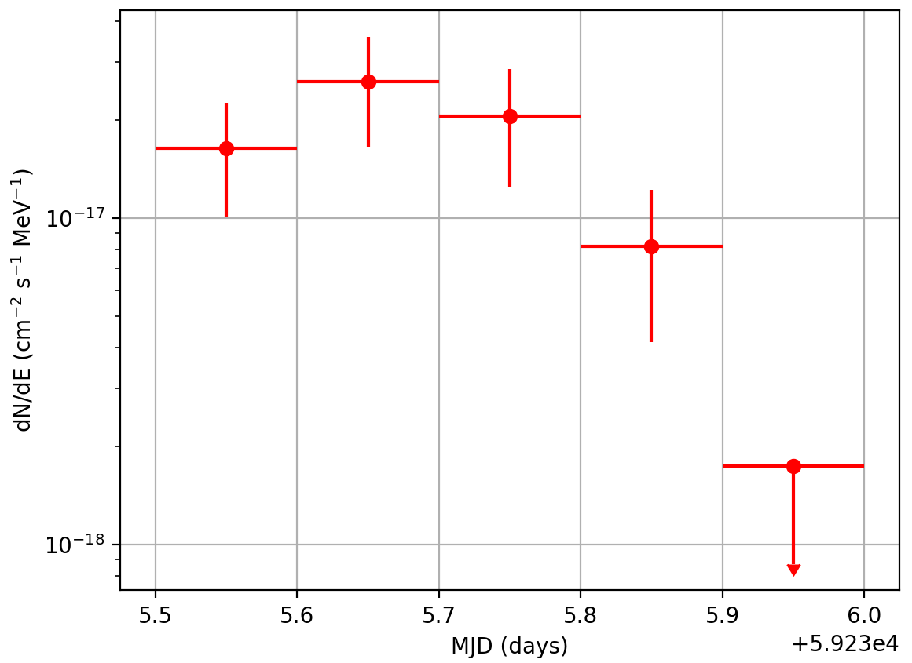

.. _1dc_howto_ligthcurve:

How to generate a light curve?
------------------------------

  .. admonition:: What you will learn

     You will learn how to **generate a light curve** for a source to study
     the temporal variation of the flux and spectrum.

You can generate a light curve using the :ref:`cslightcrv` script which
takes on input an
:ref:`event list <glossary_eventlist>`
or an
:ref:`observation definition file <glossary_obsdef>`.
Light curves cannot be generated from counts cubes since the time information
is dropped in the generation of the counts cube.

:ref:`cslightcrv` divides the event list into a number of intervals and
performs a maximum likelihood analyse for each of the intervals.
The analysis results are writted into a light curve FITS file.

The following example illustrates how you can generate a light curve for
``Src001`` for the time interval from 59235.5 to 59236.0 (MJD),
corresponding to the dates from 2021-01-21 (12:00:00) to 2021-01-22 (00:00:00)
(to convert dates to MJD and vice versa we suggest to use the
`xTime Date and Time Conversion Utility <https://heasarc.gsfc.nasa.gov/cgi-bin/Tools/xTime/xTime.pl>`_).
The time interval is linearly divided into 20 time bins.

.. code-block:: bash

   $ cslightcrv
   Input event list or observation definition XML file [events.fits] obs_selected.xml
   Input model definition XML file [$CTOOLS/share/models/crab.xml] models.xml
   Source name [Crab] Src001
   Algorithm for defining time bins (FILE|LIN|GTI) [GTI] LIN
   Lightcurve start time (UTC string, JD, MJD or MET in seconds) [MJD 51544.5] MJD 59235.5
   Lightcurve stop time (UTC string, JD, MJD or MET in seconds) [MJD 51544.6] MJD 59236.0
   Number of time bins (1-10000) [5] 20
   Analysis method (CUBE|ONOFF) [CUBE] CUBE
   Lower energy limit of events (TeV) [0.1]
   Upper energy limit of events (TeV) [100.0]
   Number of energy bins for binned (0=unbinned for Cube analysis only) (0-100) [0]
   Output light curve file [lightcurve.fits]

The resulting light curve is shown in the figure below.

   *Light curve from 59235.5 to 59236.0 (MJD) for Src001*

.. note::
   The plot was created using the ``show_lightcurve.py`` script that is
   located in the ctools example folder. The example script requires the
   `matplotlib <http://matplotlib.org>`_ Python module for display.
   You may reproduce the plot by typing

   .. code-block:: bash

      $ $CTOOLS/share/examples/python/show_lightcurve.py lightcurve.fits
