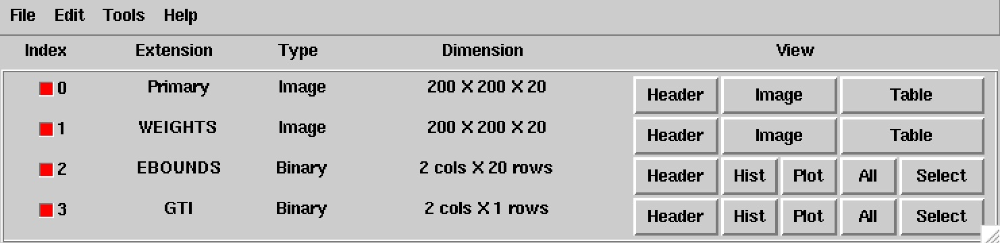
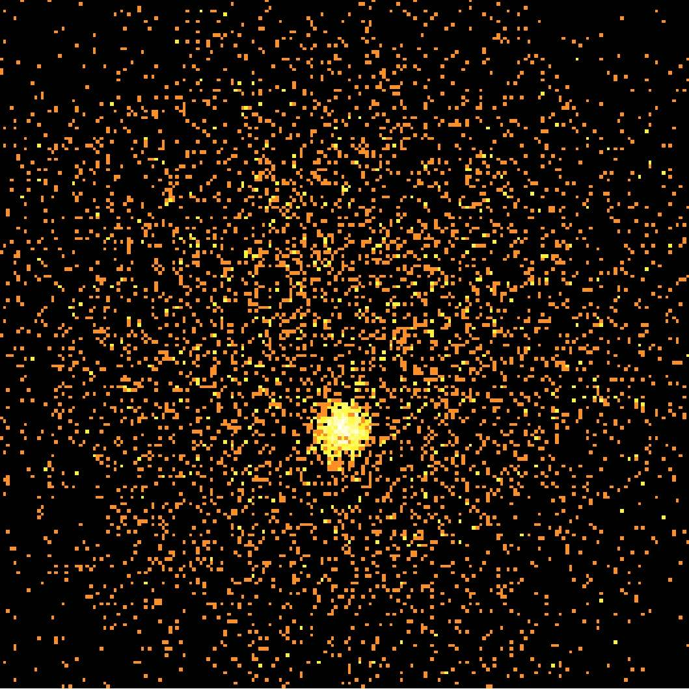

.. _start_binning:

Binning event data
------------------

  .. admonition:: What you will learn

     You will learn how to use the :ref:`ctbin` tool to **bin the selected
     event data into a counts cube**.

     A counts cube is a 3-dimensional data cube that is spanned by Right
     Ascension (or Galactic longitude), Declination (or Galactic latitude),
     and energy (by default logarithmically spaced, but this is under your
     control).

Let's now bin the selected event data into a counts cube. You do this
using the :ref:`ctbin` tool as follows:

.. code-block:: bash

   $ ctbin
   Input event list or observation definition XML file [events.fits] selected_events.fits
   First coordinate of image center in degrees (RA or galactic l) (0-360) [83.63]
   Second coordinate of image center in degrees (DEC or galactic b) (-90-90) [22.51]
   Projection method (AIT|AZP|CAR|GLS|MER|MOL|SFL|SIN|STG|TAN) [CAR]
   Coordinate system (CEL - celestial, GAL - galactic) (CEL|GAL) [CEL]
   Image scale (in degrees/pixel) [0.02]
   Size of the X axis in pixels [200]
   Size of the Y axis in pixels [200]
   Algorithm for defining energy bins (FILE|LIN|LOG) [LOG]
   Lower energy limit (TeV) [0.1]
   Upper energy limit (TeV) [100.0]
   Number of energy bins (1-200) [20]
   Output counts cube file [cntcube.fits]

In this example the events from file ``selected_events.fits`` will be binned
into a counts cube stored into the file ``cntcube.fits``. The counts cube
is centred on the pointing direction (Right Ascension 83.63 deg,
Declination 22.51 deg). A cartesian projection aligned in celestial
coordinates is used and the counts cube has
200 x 200 spatial pixels of 0.02 x 0.02 degrees in size, covering
an area of 4 deg x 4 deg, and 20 logarithmically spaced energy bins, covering
an energy range from 0.1 TeV to 100 TeV.

The ``cntcube.fits`` file produced by :ref:`ctbin` contains four extensions:

* A primary 3-dimensional image extension providing the number of events
  per counts cube bin,
* a 3-dimensional image extension ``WEIGHT`` where each bin gives the
  fractional overlap between a counts cube bin and the Region of Interest
  covered by the event list,
* a table extension ``EBOUNDS`` that defines the energy boundaries of the
  counts cube, and
* a table extension ``GTI`` that defines the Good Time Intervals of the counts
  cube.

The following image shows the ``cntcube.fits`` file produced in the example
above. The ``EBOUNDS`` table has 20 rows, one for each energy bin, while the
``GTI`` table has just a single row, indicating the start and stop time of the
simulated data.

   *Extensions of the counts cube FITS file*

An image of the first bin, covering the energy range 100 - 141 GeV, is 
shown below:

   *Image of first energy bin of the counts cube*

For illustration, the last few lines of the log file ``ctbin.log`` are 
reproduced below:

.. code-block:: none

   2018-01-24T14:23:03: +=================+
   2018-01-24T14:23:03: | Bin observation |
   2018-01-24T14:23:03: +=================+
   2018-01-24T14:23:03: === CTA observation (id=000001) ===
   2018-01-24T14:23:03:  Events in list ............: 21974
   2018-01-24T14:23:03:  Events in cube ............: 18799
   2018-01-24T14:23:03:  Events outside RoI ........: 0
   2018-01-24T14:23:03:  Events with invalid WCS ...: 0
   2018-01-24T14:23:03:  Events outside cube area ..: 3175
   2018-01-24T14:23:03:  Events outside energy bins : 0

From the 21974 events that were simulated and stored in the
``selected_events.fits`` file, 18799 lie within the cube boundaries and are thus
put into the resulting counts cube.
