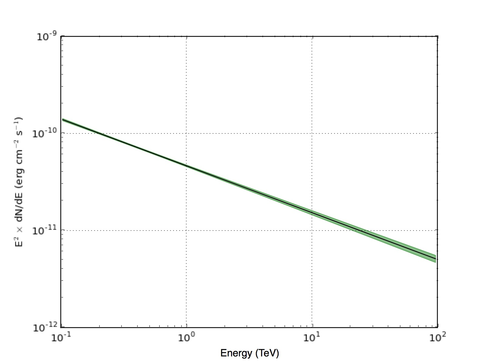

.. _start_butterfly:

Generating a butterfly diagram of the source spectrum
-----------------------------------------------------

  .. admonition:: What you will learn

     You will learn how to use the :ref:`ctbutterfly` tool to **generate a
     butterfly diagram for the source spectrum**.

The :ref:`ctlike` tool returns the statistic uncertainties for all fitted
parameters of the spectral model, but you may be interested in the manifold
of spectral models that are statistically compatible with the data. For this
purpose you should generate a butterfly diagram. You do this using the
:ref:`ctbutterfly` tool as follows:

.. code-block:: bash

   $ ctbutterfly
   Input event list, counts cube or observation definition XML file [events.fits] cntcube.fits
   Input exposure cube file [NONE] expcube.fits
   Input PSF cube file [NONE] psfcube.fits
   Input background cube file [NONE] bkgcube.fits
   Source of interest [Crab]
   Input model definition XML file [$CTOOLS/share/models/crab.xml] crab_results.xml
   Lower energy limit (TeV) [0.1]
   Upper energy limit (TeV) [100.0]
   Output ASCII file [butterfly.txt]

The :ref:`ctbutterfly` tool creates an ASCII file ``butterfly.txt`` that
contains for each energy in MeV (column 1) the best fitted intensity
(column 2), the minimum intensity (column 3) and the maximum intensity
(column 4) that is compatible with the data, all in units of
:math:`{\rm photons} \, {\rm cm}^{-2} \, {\rm s}^{-1} \, {\rm MeV}^{-1}`.
The number of energies is given by the hidden ``enumbins`` parameter which by
default is set to 100. Below an excerpt of the first lines of the
``butterfly.txt`` file:

.. code-block:: none
   
   103514.216667934 8.08473784238882e-15 7.8714657958793e-15 8.29800988889835e-15
   110917.48152624 6.81070529541223e-15 6.63639780809342e-15 6.98501278273104e-15
   118850.222743702 5.73744103089563e-15 5.59501033791654e-15 5.87987172387472e-15
   127350.308101666 4.83330700055084e-15 4.71693954114459e-15 4.94967445995709e-15
   ...

A graphical display of the results is shown below:

   *Butterfly diagram of the Crab nebula*

.. note::
   The ctools package does not contain any tools or scripts for graphical
   display of results since results are generally written into standard FITS
   files that are readily displayed by existing astronomical tools.

   Nevertheless, for your convenience several scripts for graphical display
   are included in the ctools package that rely on the
   `matplotlib <http://matplotlib.org>`_
   Python module. You can find these scripts in the
   ``$CTOOLS/share/examples/python`` folder.

   Read the section about :ref:`sec_plotting` to learn more about the
   available scripts. The plot above was generated using:

   .. code-block:: bash

      $ $CTOOLS/share/examples/python/show_butterfly.py butterfly.txt
