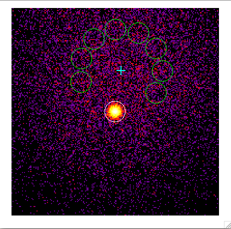

.. _start_onoff:

Doing an On/Off analysis
--------------------------

  .. admonition:: What you will learn

     You will learn how to **adjust a parametrised spectral model to
     the events deriving the background from the data**.

     Gamma-ray events are rare compared to the background events,
     hence small imperfections of the background model can have a
     large impact on the estimated source parameters.

     In classical IACT analyses the background has been normally
     derived from the data, by defining On (source) and Off
     (background) regions. An On/Off analysis is recommended if you
     want to assure minimal dependency on the Monte Carlo background model.

Last, we consider the classical technique for IACT spectral analysis,
in which 1D spectra for On and Off regions are used jointly to
determine the source parameters.

The script :ref:`csphagen` is used to derive a set of On/Off
observations from the event lists.  This script saves the source (On) and background (Off) count spectra
in `OGIP format <https://heasarc.gsfc.nasa.gov/docs/heasarc/ofwg/docs/spectra/ogip_92_007/node5.html>`_,
along with the relevant information from the :ref:`instrument response functions <glossary_irf>`
refashioned according to this format conventions.

:ref:`csphagen` calculates the background counts using the REFLECTED algorithm, in which, for each individual
observation the background regions have the same shape as the source region, and
are rotated around the center of the camera keeping the same offset. As many
reflected regions as possible are used, excluding the area of the camera near
the source position. Since the background rates are expected to be approximately
radially symmetric in camera coordinates, this method minimizes the impact of
the background rate modeling from Monte Carlo. An optional exclusion map (in
FITS WCS format) can be provided as input through the ``inexclusion`` hidden
parameter if other regions of significant gamma-ray emission ought to be
excluded from the background computation.

.. code-block:: bash

   $ csphagen
   Input event list or observation definition XML file [obs.xml] events_edisp.fits
   Calibration database [prod2]
   Instrument response function [South_0.5h]
   Binning algorithm (LIN|LOG|FILE) [LOG]
   Lower energy limit (TeV) [0.1]
   Upper energy limit (TeV) [100.0]
   Number of energy bins [120] 30
   Coordinate system (CEL - celestial, GAL - galactic) (CEL|GAL) [CEL]
   Right Ascension of source region centre (deg) (0-360) [83.63]
   Declination of source region centre (deg) (-90-90) [22.01]
   Radius of source region circle (deg) (0-180) [0.2]
   Stack multiple observations into single PHA, ARF and RMF files? [no]
   Output observation definition XML file [onoff_obs.xml]

.. note::

   - We have used the events simulated accounting for energy
     dispersion, since energy dispersion is always used in On/Off analysis.
   
   - If you wish to limit the number of observations considered to
     those pointed closer to the source, you can do this either at the
     observation selection level (see :ref:`csobsselect`), or directly
     in :ref:`csphagen` via the hidden ``maxoffset`` parameter.
   
   - The parameters specified control the energy binning of the count
     spectra in *reconstructed* energy. For the computation of the
     instrument response we need a fine binning in *true* energy,
     which is controlled by the hidden parameters ``etruemin``,
     ``etruemax``, and ``etruebins``.

This has produced in output several files. The xml observations file
contains a single On/Off observation.

.. code-block:: bash

   <?xml version="1.0" encoding="UTF-8" standalone="no"?>
   <observation_list title="observation list">
      <observation name="" id="" instrument="CTAOnOff" statistic="cstat">
         <parameter name="Pha_on" file="onoff_pha_on.fits" />
         <parameter name="Pha_off" file="onoff_pha_off.fits" />
         <parameter name="Arf" file="onoff_arf.fits" />
         <parameter name="Rmf" file="onoff_rmf.fits" />
      </observation>
   </observation_list>

The observation entails four FITS files. ``onoff_pha_on.fits`` and
``onoff_pha_off.fits`` contain the On and Off spectra, respectively.
These are stored in the SPECTRUM extension of the FITS file, along with ancillary
information, notably the scaling factor to be applied to the background spectrum,
BACKSCAL. The third extension, EBOUNDS, contains the boundaries of the energy
bins, as defined by the binning parameters in input to csphagen. The file
``onoff_arf.fits`` contains the spectral response of the instrument
extracted fromt the :ref:`instrument response functions <glossary_irf>`,
including effective area for gamma-ray detection and background rates, in the
SPECRESP extension. The file ``onoff_rmf.fits`` contains the remaining
part of the instrument response, i.e., an energy redistribution matrix (MATRIX),
as well as another instance of the EBOUNDS table. Note that we are performing a
1D analysis: the effect of the PSF is already folded into the effective area
computation.

.. note::

    The first part of the FITS files names (and a full path to the desired
    location) can be set using the hidden ``prefix`` parameter of
    :ref:`csphagen`.

There are also come ancillary `ds9 <http://ds9.si.edu>`_ region files, that show
the On region and the Off regions, ``onoff_on.reg`` and
``onoff_off.reg``, respectively. Below there is
a skymap where you can see the pointing direction along with the position of
the On and Off regions.

   *Sky map of the events. The cross shows the pointing direction,
   the green circles the Off regions, and the white circle the On
   region.*

The model to be fit to the observations needs to specify for the
background component that we are dealing with a ``CTAOnOff`` analysis.

.. code-block:: bash

   <?xml version="1.0" standalone="no"?>
   <source_library title="source library">
      <source name="Crab" type="PointSource">
         <spectrum type="PowerLaw">
            <parameter name="Prefactor"   scale="1e-16" value="5.7"  min="1e-07" max="1000.0" free="1"/>
            <parameter name="Index"       scale="-1"    value="2.48" min="0.0"   max="+5.0"   free="1"/>
            <parameter name="PivotEnergy" scale="1e6"   value="0.3"  min="0.01"  max="1000.0" free="0"/>
         </spectrum>
         <spatialModel type="PointSource">
            <parameter name="RA"  scale="1.0" value="83.6331" min="-360" max="360" free="0"/>
            <parameter name="DEC" scale="1.0" value="22.0145" min="-90"  max="90"  free="0"/>
         </spatialModel>
      </source>
      <source name="CTABackgroundModel" type="CTAIrfBackground" instrument="CTAOnOff">
         <spectrum type="PowerLaw">
            <parameter name="Prefactor"   scale="1.0"  value="1.0"  min="1e-3" max="1e+3"   free="1"/>
            <parameter name="Index"       scale="1.0"  value="0.0"  min="-5.0" max="+5.0"   free="1"/>
            <parameter name="PivotEnergy" scale="1e6"  value="1.0"  min="0.01" max="1000.0" free="0"/>
         </spectrum>
      </source>
   </source_library>

At this point we can run an On/Off analysis just by passing the On/Off
observation container to  :ref:`ctlike`.

.. code-block:: bash
		
	Input event list, counts cube or observation definition XML file [selected_events.fits] onoff_obs.xml 
	Input model definition XML file [$CTOOLS/share/models/crab.xml] crab_onoff.xml 
	Output model definition XML file [crab_results.xml]

Below you see the corresponding output from the ``ctlike.log``
file.The fitted parameters are still the same within statistical
uncertainties as the ones found in binned/unbinned mode. This may not
always be the case, especially if the background is not well known a priori.

.. code-block:: bash
		
   2017-11-28T17:26:56: +=================================+
   2017-11-28T17:26:56: | Maximum likelihood optimisation |
   2017-11-28T17:26:56: +=================================+
   2017-11-28T17:26:56:  >Iteration   0: -logL=-48350.908, Lambda=1.0e-03
   2017-11-28T17:26:56:  >Iteration   1: -logL=-48352.759, Lambda=1.0e-03, delta=1.852, step=1.0e+00, max(|grad|)=2.829489 [Index:7]
   2017-11-28T17:26:56:  >Iteration   2: -logL=-48352.760, Lambda=1.0e-04, delta=0.000, step=1.0e+00, max(|grad|)=0.002408 [Index:3]
   2017-11-28T17:26:56:
   2017-11-28T17:26:56: +=========================================+
   2017-11-28T17:26:56: | Maximum likelihood optimisation results |
   2017-11-28T17:26:56: +=========================================+
   2017-11-28T17:26:56: === GOptimizerLM ===
   2017-11-28T17:26:56:  Optimized function value ..: -48352.760
   2017-11-28T17:26:56:  Absolute precision ........: 0.005
   2017-11-28T17:26:56:  Acceptable value decrease .: 2
   2017-11-28T17:26:56:  Optimization status .......: converged
   2017-11-28T17:26:56:  Number of parameters ......: 10
   2017-11-28T17:26:56:  Number of free parameters .: 4
   2017-11-28T17:26:56:  Number of iterations ......: 2
   2017-11-28T17:26:56:  Lambda ....................: 1e-05
   2017-11-28T17:26:56:  Maximum log likelihood ....: 48352.760
   2017-11-28T17:26:56:  Observed events  (Nobs) ...: 6656.000
   2017-11-28T17:26:56:  Predicted events (Npred) ..: 6655.663 (Nobs - Npred = 0.337440257160779)
   2017-11-28T17:26:56: === GModels ===
   2017-11-28T17:26:56:  Number of models ..........: 2
   2017-11-28T17:26:56:  Number of parameters ......: 10
   2017-11-28T17:26:56: === GModelSky ===
   2017-11-28T17:26:56:  Name ......................: Crab
   2017-11-28T17:26:56:  Instruments ...............: all
   2017-11-28T17:26:56:  Instrument scale factors ..: unity
   2017-11-28T17:26:56:  Observation identifiers ...: all
   2017-11-28T17:26:56:  Model type ................: PointSource
   2017-11-28T17:26:56:  Model components ..........: "PointSource" * "PowerLaw" * "Constant"
   2017-11-28T17:26:56:  Number of parameters ......: 6
   2017-11-28T17:26:56:  Number of spatial par's ...: 2
   2017-11-28T17:26:56:   RA .......................: 83.6331 [-360,360] deg (fixed,scale=1)
   2017-11-28T17:26:56:   DEC ......................: 22.0145 [-90,90] deg (fixed,scale=1)
   2017-11-28T17:26:56:  Number of spectral par's ..: 3
   2017-11-28T17:26:56:   Prefactor ................: 5.69533666063277e-16 +/- 7.77619410705106e-18 [1e-23,1e-13] ph/cm2/s/MeV (free,scale=1e-16,gradient)
   2017-11-28T17:26:56:   Index ....................: -2.47347083803876 +/- 0.0114544870463654 [-0,-5]  (free,scale=-1,gradient)
   2017-11-28T17:26:56:   PivotEnergy ..............: 300000 [10000,1000000000] MeV (fixed,scale=1000000,gradient)
   2017-11-28T17:26:56:  Number of temporal par's ..: 1
   2017-11-28T17:26:56:   Normalization ............: 1 (relative value) (fixed,scale=1,gradient)
   2017-11-28T17:26:56: === GCTAModelIrfBackground ===
   2017-11-28T17:26:56:  Name ......................: CTABackgroundModel
   2017-11-28T17:26:56:  Instruments ...............: CTAOnOff
   2017-11-28T17:26:56:  Instrument scale factors ..: unity
   2017-11-28T17:26:56:  Observation identifiers ...: all
   2017-11-28T17:26:56:  Model type ................: "PowerLaw" * "Constant"
   2017-11-28T17:26:56:  Number of parameters ......: 4
   2017-11-28T17:26:56:  Number of spectral par's ..: 3
   2017-11-28T17:26:56:   Prefactor ................: 1.00017594707712 +/- 0.0373732914079376 [0.001,1000] ph/cm2/s/MeV (free,scale=1,gradient)
   2017-11-28T17:26:56:   Index ....................: 0.0190520959815092 +/- 0.0220805114253248 [-5,5]  (free,scale=1,gradient)
   2017-11-28T17:26:56:   PivotEnergy ..............: 1000000 [10000,1000000000] MeV (fixed,scale=1000000,gradient)
   2017-11-28T17:26:56:  Number of temporal par's ..: 1
   2017-11-28T17:26:56:   Normalization ............: 1 (relative value) (fixed,scale=1,gradient)

:ref:`ctlike` has a hidden parameter called ``statistic`` that sets the
statistic used for the fit.

- The DEFAULT for OnOff osbervations is CSTAT, i.e., Poisson signal and Poisson
  background. A spectral model for the signal and a spectral model for the
  background are jointly fit to the On and Off spectra.
- WSTAT is a special case of CSTAT, Poisson signal with Poisson background, in
  which you do not need to have a spectral model for the background and
  free parameters associated with it. The number of background counts in each
  energy bin is treated as a nuisance parameter, derived from the On and Off
  counts by profiling the likelihood function. In this case the only assumption
  is that the background rate spectrum is the same in the On and Off regions.

.. warning::
    Beware that the profiling may yield unphysical results (negative background
    counts) if the number of events in the Off spectra are zero. In this case a
    null number of expected background events must be enforced,
    which can result in a bias on the source's parameters. You can address this
    issue by stacking multiple observations, using a coarser energy binning, or
    using CSTAT instead (if you have a spectral model for the background that is
    good enough). See the `XSPEC manual Appendix B <https://heasarc.gsfc.nasa.gov/xanadu/xspec/manual/XSappendixStatistics.html>`_
    for more information.

- You can also use CHI2, a classical chi square, i.e., a Gaussian signal and
  Gaussian background. As for CSTAT, a spectral model for the signal and a
  spectral model for the background are jointly fit to the On and Off
  spectra.

.. note::

   Many scripts can also be used in On/Off mode, including
   :ref:`ctbutterfly` and :ref:`csspec` that were used earlier. It is
   sufficient to replace the input counts cube/event list with an
   On/Off observation container to activate On/Off mode for these
   tools.
	
	
