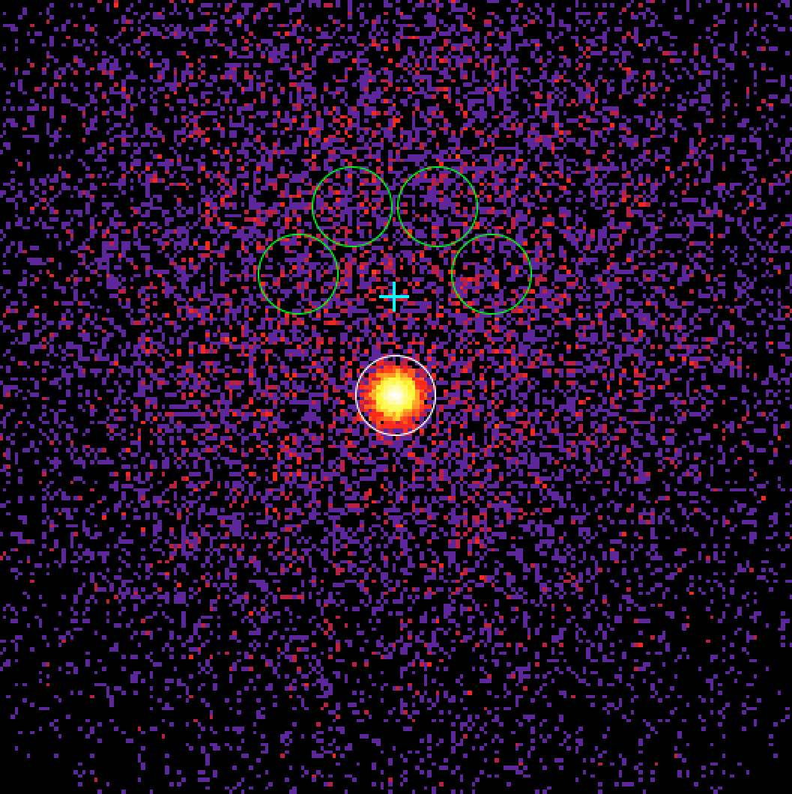

.. _start_onoff:

Doing an On/Off analysis
------------------------

  .. admonition:: What you will learn

     You will learn how to **adjust a parametrised spectral model to
     the events deriving the background from the data**.

     In classical IACT analyses the background has been normally
     derived from the data, by defining On (source) and Off
     (background) regions. An On/Off analysis is recommended if you
     want to assure minimal dependency on the Monte Carlo background model.

  .. warning::
     For the time being the **On/Off analysis only works for point sources**. Make
     sure that the spatial component of the model you want to analyse is of
     type ``PointSource``.

Finally, we consider the classical technique for IACT spectral analysis,
in which 1D spectra for On and Off regions are used jointly to
determine the source parameters.

The script :ref:`csphagen` is used to derive a set of On/Off observations from
the event lists. This script saves the source (On) and background (Off) count
spectra in
`OGIP format <https://heasarc.gsfc.nasa.gov/docs/heasarc/ofwg/docs/spectra/ogip_92_007/node5.html>`_,
along with the relevant information from the :ref:`instrument response functions <glossary_irf>`
refashioned according to this format conventions.

By default, :ref:`csphagen` calculates the background counts using the
``REFLECTED`` algorithm, in which, for each individual observation the
background regions have the same shape as the source region, and are rotated
around the center of the camera keeping the same offset. As many
reflected regions as possible are used, excluding the area of the camera near
the source position. Since the background rates are expected to be approximately
radially symmetric in camera coordinates, this method minimizes the impact of
the background rate modeling from Monte Carlo. An optional exclusion map (in
FITS WCS format) can be provided as input through the hidden ``inexclusion``
parameter if other regions of significant gamma-ray emission ought to be
excluded from the background computation.

To derive On/Off observations from the ``events_edisp.fits`` event list, type:

.. code-block:: bash

   $ csphagen
   Input event list or observation definition XML file [obs.xml] events_edisp.fits
   Calibration database [prod2]
   Instrument response function [South_0.5h]
   Input model definition XML file (if NONE, use point source) [NONE] $CTOOLS/share/models/crab.xml
   Source name [Crab]
   Algorithm for defining energy bins (FILE|LIN|LOG) [LOG]
   Start value for first energy bin in TeV [0.1]
   Stop value for last energy bin in TeV [100.0]
   Number of energy bins [120] 30
   Stack multiple observations into single PHA, ARF and RMF files? [no]
   Output observation definition XML file [onoff_obs.xml]
   Output model definition XML file [onoff_model.xml]
   Method for background estimation (REFLECTED|CUSTOM) [REFLECTED]
   Coordinate system (CEL - celestial, GAL - galactic) (CEL|GAL) [CEL]
   Right Ascension of source region centre (deg) (0-360) [83.63]
   Declination of source region centre (deg) (-90-90) [22.01]
   Radius of source region circle (deg) (0-180) [0.2]

.. note::
   We have used the events simulated accounting for energy dispersion, since
   energy dispersion is always used in On/Off analysis.

.. note::
   If you wish to limit the number of observations considered to those
   pointed closer to the source, you can do this either at the observation
   selection level (see :ref:`csobsselect`), or directly in :ref:`csphagen`
   via the hidden ``maxoffset`` parameter.

.. note::
   The specified parameters control the energy binning of the count spectra
   in *reconstructed* energy. For the computation of the instrument response
   we need a fine binning in *true* energy, which is controlled by the hidden
   parameters ``etruemin``, ``etruemax``, and ``etruebins``.

The :ref:`csphagen` script has produced several files. The
:ref:`output observation definition XML file <glossary_obsdef>`
``onoff_obs.xml`` contains a single On/Off observation:

.. code-block:: xml

   <?xml version="1.0" encoding="UTF-8" standalone="no"?>
   <observation_list title="observation list">
      <observation name="" id="" instrument="CTAOnOff" statistic="cstat">
         <parameter name="Pha_on"  file="onoff_pha_on.fits"/>
         <parameter name="Pha_off" file="onoff_pha_off.fits"/>
         <parameter name="Arf"     file="onoff_arf.fits"/>
         <parameter name="Rmf"     file="onoff_rmf.fits"/>
      </observation>
   </observation_list>

.. note::
   Note that the instrument name for an On/Off analysis is ``CTAOnOff``.
   This allows combining an On/Off observations with other observation
   types into a single
   :ref:`observation definition file <glossary_obsdef>`.

The observation entails four FITS files. ``onoff_pha_on.fits`` and
``onoff_pha_off.fits`` contain the On and Off spectra, respectively.
These are stored in the ``SPECTRUM`` extension of the FITS file, along with
ancillary information, notably the scaling factor to be applied to the
background spectrum, ``BACKSCAL``. The third extension, ``EBOUNDS``, contains
the boundaries of the energy bins, as defined by the binning parameters in
input to :ref:`csphagen`.

The file ``onoff_arf.fits`` contains the spectral response of the instrument
extracted from the :ref:`instrument response functions <glossary_irf>`,
including effective area for gamma-ray detection and background rates, in the
``SPECRESP`` extension. The file ``onoff_rmf.fits`` contains the remaining
part of the instrument response, i.e., an energy redistribution matrix
(``MATRIX``), as well as another instance of the ``EBOUNDS`` table. Note that
we are performing a 1D analysis: the effect of the ``PSF`` is already folded
into the spectral response computation.

.. note::
   The first part of the FITS files names (and a full path to the desired
   location) can be set using the hidden ``prefix`` parameter of
   :ref:`csphagen`.

:ref:`csphagen` also produced the
:ref:`model definition XML file <glossary_moddef>`
``onoff_model.xml`` that can be directly used for model fitting:

.. code-block:: xml

   <?xml version="1.0" encoding="UTF-8" standalone="no"?>
   <source_library title="source library">
     <source name="Crab" type="PointSource">
       <spectrum type="PowerLaw">
         <parameter name="Prefactor" value="5.7" error="0" scale="1e-16" min="1e-07" max="1000" free="1" />
         <parameter name="Index" value="2.48" error="0" scale="-1" min="0" max="5" free="1" />
         <parameter name="PivotEnergy" value="0.3" scale="1000000" min="0.01" max="1000" free="0" />
       </spectrum>
       <spatialModel type="PointSource">
         <parameter name="RA" value="83.6331" scale="1" min="-360" max="360" free="0" />
         <parameter name="DEC" value="22.0145" scale="1" min="-90" max="90" free="0" />
       </spatialModel>
     </source>
     <source name="CTABackgroundModel" type="CTAIrfBackground" instrument="CTAOnOff">
       <spectrum type="PowerLaw">
         <parameter name="Prefactor" value="1" error="0" scale="1" min="0.001" max="1000" free="1" />
         <parameter name="Index" value="0" error="0" scale="1" min="-5" max="5" free="1" />
         <parameter name="PivotEnergy" value="1" scale="1000000" min="0.01" max="1000" free="0" />
       </spectrum>
     </source>
   </source_library>

There are also come ancillary `ds9 <http://ds9.si.edu>`_ region files, that show
the On region and the Off regions, ``onoff_on.reg`` and
``onoff_off.reg``, respectively. Below there is
a skymap where you can see the pointing direction along with the position of
the On and Off regions.

   *Sky map of the events. The cross shows the pointing direction,
   the green circles the Off regions, and the white circle the On
   region.*

You can now fit the model ``onoff_model.xml`` using an On/Off analysis by
specifying the
:ref:`output observation definition file <glossary_obsdef>`
and the
:ref:`model definition file <glossary_moddef>`
to :ref:`ctlike`:

.. code-block:: bash

   $ ctlike
   Input event list, counts cube or observation definition XML file [selected_events_edisp.fits] onoff_obs.xml
   Input model definition XML file [$CTOOLS/share/models/crab.xml] onoff_model.xml
   Output model definition XML file [crab_results_edisp.xml] crab_results.xml

Below you see the corresponding output from the ``ctlike.log`` file. The fitted
parameters are still the same within statistical uncertainties as the ones
found in binned/unbinned mode. This may not always be the case, especially if
the background is not well known a priori.

.. code-block:: none

  2019-04-02T14:55:29: +=================================+
  2019-04-02T14:55:29: | Maximum likelihood optimisation |
  2019-04-02T14:55:29: +=================================+
  2019-04-02T14:55:29:  >Iteration   0: -logL=-47436.484, Lambda=1.0e-03
  2019-04-02T14:55:29:  >Iteration   1: -logL=-47439.247, Lambda=1.0e-03, delta=2.762, step=1.0e+00, max(|grad|)=14.136296 [Index:7]
  2019-04-02T14:55:29:  >Iteration   2: -logL=-47439.266, Lambda=1.0e-04, delta=0.020, step=1.0e+00, max(|grad|)=0.089563 [Index:7]
  2019-04-02T14:55:29:  >Iteration   3: -logL=-47439.266, Lambda=1.0e-05, delta=0.000, step=1.0e+00, max(|grad|)=0.001727 [Index:7]
  2019-04-02T14:55:29:
  2019-04-02T14:55:29: +=========================================+
  2019-04-02T14:55:29: | Maximum likelihood optimisation results |
  2019-04-02T14:55:29: +=========================================+
  2019-04-02T14:55:29: === GOptimizerLM ===
  2019-04-02T14:55:29:  Optimized function value ..: -47439.266
  2019-04-02T14:55:29:  Absolute precision ........: 0.005
  2019-04-02T14:55:29:  Acceptable value decrease .: 2
  2019-04-02T14:55:29:  Optimization status .......: converged
  2019-04-02T14:55:29:  Number of parameters ......: 10
  2019-04-02T14:55:29:  Number of free parameters .: 4
  2019-04-02T14:55:29:  Number of iterations ......: 3
  2019-04-02T14:55:29:  Lambda ....................: 1e-06
  2019-04-02T14:55:29:  Maximum log likelihood ....: 47439.266
  2019-04-02T14:55:29:  Observed events  (Nobs) ...: 7607.000
  2019-04-02T14:55:29:  Predicted events (Npred) ..: 7606.425 (Nobs - Npred = 0.575097306655152)
  2019-04-02T14:55:29: === GModels ===
  2019-04-02T14:55:29:  Number of models ..........: 2
  2019-04-02T14:55:29:  Number of parameters ......: 10
  2019-04-02T14:55:29: === GModelSky ===
  2019-04-02T14:55:29:  Name ......................: Crab
  2019-04-02T14:55:29:  Instruments ...............: all
  2019-04-02T14:55:29:  Observation identifiers ...: all
  2019-04-02T14:55:29:  Model type ................: PointSource
  2019-04-02T14:55:29:  Model components ..........: "PointSource" * "PowerLaw" * "Constant"
  2019-04-02T14:55:29:  Number of parameters ......: 6
  2019-04-02T14:55:29:  Number of spatial par's ...: 2
  2019-04-02T14:55:29:   RA .......................: 83.6331 [-360,360] deg (fixed,scale=1)
  2019-04-02T14:55:29:   DEC ......................: 22.0145 [-90,90] deg (fixed,scale=1)
  2019-04-02T14:55:29:  Number of spectral par's ..: 3
  2019-04-02T14:55:29:   Prefactor ................: 5.71422768206296e-16 +/- 7.28119011001326e-18 [1e-23,1e-13] ph/cm2/s/MeV (free,scale=1e-16,gradient)
  2019-04-02T14:55:29:   Index ....................: -2.47772427704665 +/- 0.0108450088768338 [-0,-5]  (free,scale=-1,gradient)
  2019-04-02T14:55:29:   PivotEnergy ..............: 300000 [10000,1000000000] MeV (fixed,scale=1000000,gradient)
  2019-04-02T14:55:29:  Number of temporal par's ..: 1
  2019-04-02T14:55:29:   Normalization ............: 1 (relative value) (fixed,scale=1,gradient)
  2019-04-02T14:55:29:  Number of scale par's .....: 0
  2019-04-02T14:55:29: === GCTAModelIrfBackground ===
  2019-04-02T14:55:29:  Name ......................: CTABackgroundModel
  2019-04-02T14:55:29:  Instruments ...............: CTAOnOff
  2019-04-02T14:55:29:  Observation identifiers ...: all
  2019-04-02T14:55:29:  Model type ................: "PowerLaw" * "Constant"
  2019-04-02T14:55:29:  Number of parameters ......: 4
  2019-04-02T14:55:29:  Number of spectral par's ..: 3
  2019-04-02T14:55:29:   Prefactor ................: 0.925471278485926 +/- 0.0482291417226665 [0.001,1000] ph/cm2/s/MeV (free,scale=1,gradient)
  2019-04-02T14:55:29:   Index ....................: -0.0649030558071282 +/- 0.0301870339200633 [-5,5]  (free,scale=1,gradient)
  2019-04-02T14:55:29:   PivotEnergy ..............: 1000000 [10000,1000000000] MeV (fixed,scale=1000000,gradient)
  2019-04-02T14:55:29:  Number of temporal par's ..: 1
  2019-04-02T14:55:29:   Normalization ............: 1 (relative value) (fixed,scale=1,gradient)

:ref:`ctlike` has a hidden parameter called ``statistic`` that sets the
statistic used for the fit. By default, :ref:`ctlike` will use ``CSTAT``
which is the statistic for a Poisson signal and Poisson background. When
``CSTAT`` is used, a spectral model for the signal and a spectral model for the
background are jointly fit to the On and Off spectra.

Alternatively, you can use ``WSTAT`` for an On/Off analysis, which treats the
number of background counts in each energy bin as a nuisance parameter that is
derived from the On and Off counts by profiling the likelihood function. In
this case, the only assumption is that the background rate spectrum is the same
in the On and Off regions. Below the results for a :ref:`ctlike` run with
the ``statistic=wstat`` option.

.. code-block:: none

   2019-04-02T15:56:29: +=================================+
   2019-04-02T15:56:29: | Maximum likelihood optimisation |
   2019-04-02T15:56:29: +=================================+
   2019-04-02T15:56:29:    Parameter "Prefactor" has zero curvature. Fix parameter.
   2019-04-02T15:56:29:    Parameter "Index" has zero curvature. Fix parameter.
   2019-04-02T15:56:29:  >Iteration   0: -logL=13.699, Lambda=1.0e-03
   2019-04-02T15:56:29:  >Iteration   1: -logL=13.645, Lambda=1.0e-03, delta=0.054, step=1.0e+00, max(|grad|)=0.226348 [Index:3]
   2019-04-02T15:56:29:  >Iteration   2: -logL=13.645, Lambda=1.0e-04, delta=0.000, step=1.0e+00, max(|grad|)=0.001120 [Index:3]
   2019-04-02T15:56:29:    Free parameter "Prefactor" after convergence was reached with frozen parameter.
   2019-04-02T15:56:29:    Free parameter "Index" after convergence was reached with frozen parameter.
   2019-04-02T15:56:29:
   2019-04-02T15:56:29: +=========================================+
   2019-04-02T15:56:29: | Maximum likelihood optimisation results |
   2019-04-02T15:56:29: +=========================================+
   2019-04-02T15:56:29: === GOptimizerLM ===
   2019-04-02T15:56:29:  Optimized function value ..: 13.645
   2019-04-02T15:56:29:  Absolute precision ........: 0.005
   2019-04-02T15:56:29:  Acceptable value decrease .: 2
   2019-04-02T15:56:29:  Optimization status .......: converged
   2019-04-02T15:56:29:  Number of parameters ......: 10
   2019-04-02T15:56:29:  Number of free parameters .: 4
   2019-04-02T15:56:29:  Number of iterations ......: 2
   2019-04-02T15:56:29:  Lambda ....................: 1e-05
   2019-04-02T15:56:29:  Maximum log likelihood ....: -13.645
   2019-04-02T15:56:29:  Observed events  (Nobs) ...: 7607.000
   2019-04-02T15:56:29:  Predicted events (Npred) ..: 7606.133 (Nobs - Npred = 0.866926153597888)
   2019-04-02T15:56:29: === GModels ===
   2019-04-02T15:56:29:  Number of models ..........: 2
   2019-04-02T15:56:29:  Number of parameters ......: 10
   2019-04-02T15:56:29: === GModelSky ===
   2019-04-02T15:56:29:  Name ......................: Crab
   2019-04-02T15:56:29:  Instruments ...............: all
   2019-04-02T15:56:29:  Observation identifiers ...: all
   2019-04-02T15:56:29:  Model type ................: PointSource
   2019-04-02T15:56:29:  Model components ..........: "PointSource" * "PowerLaw" * "Constant"
   2019-04-02T15:56:29:  Number of parameters ......: 6
   2019-04-02T15:56:29:  Number of spatial par's ...: 2
   2019-04-02T15:56:29:   RA .......................: 83.6331 [-360,360] deg (fixed,scale=1)
   2019-04-02T15:56:29:   DEC ......................: 22.0145 [-90,90] deg (fixed,scale=1)
   2019-04-02T15:56:29:  Number of spectral par's ..: 3
   2019-04-02T15:56:29:   Prefactor ................: 5.71398803734648e-16 +/- 7.28140878478654e-18 [1e-23,1e-13] ph/cm2/s/MeV (free,scale=1e-16,gradient)
   2019-04-02T15:56:29:   Index ....................: -2.47775827196727 +/- 0.0108569325078945 [-0,-5]  (free,scale=-1,gradient)
   2019-04-02T15:56:29:   PivotEnergy ..............: 300000 [10000,1000000000] MeV (fixed,scale=1000000,gradient)
   2019-04-02T15:56:29:  Number of temporal par's ..: 1
   2019-04-02T15:56:29:   Normalization ............: 1 (relative value) (fixed,scale=1,gradient)
   2019-04-02T15:56:29:  Number of scale par's .....: 0
   2019-04-02T15:56:29: === GCTAModelIrfBackground ===
   2019-04-02T15:56:29:  Name ......................: CTABackgroundModel
   2019-04-02T15:56:29:  Instruments ...............: CTAOnOff
   2019-04-02T15:56:29:  Observation identifiers ...: all
   2019-04-02T15:56:29:  Model type ................: "PowerLaw" * "Constant"
   2019-04-02T15:56:29:  Number of parameters ......: 4
   2019-04-02T15:56:29:  Number of spectral par's ..: 3
   2019-04-02T15:56:29:   Prefactor ................: 1 +/- 0 [0.001,1000] ph/cm2/s/MeV (free,scale=1,gradient)
   2019-04-02T15:56:29:   Index ....................: 0 +/- 0 [-5,5]  (free,scale=1,gradient)
   2019-04-02T15:56:29:   PivotEnergy ..............: 1000000 [10000,1000000000] MeV (fixed,scale=1000000,gradient)
   2019-04-02T15:56:29:  Number of temporal par's ..: 1
   2019-04-02T15:56:29:   Normalization ............: 1 (relative value) (fixed,scale=1,gradient)

.. warning::
   Beware that the profiling may yield unphysical results (negative background
   counts) if the number of events in the Off spectra are zero. In this case a
   null number of expected background events must be enforced,
   which can result in a bias on the source's parameters. You can address this
   issue by stacking multiple observations, using a coarser energy binning, or
   using ``CSTAT`` instead (if you have a spectral model for the background that is
   good enough). See the
   `XSPEC manual Appendix B <https://heasarc.gsfc.nasa.gov/xanadu/xspec/manual/XSappendixStatistics.html>`_
   for more information.

.. note::
   Many scripts can also be used in On/Off mode, including
   :ref:`ctbutterfly` and :ref:`csspec` that were used earlier. It is
   sufficient to replace the input counts cube/event list with an
   On/Off
   :ref:`output observation definition file <glossary_obsdef>`
   to activate On/Off mode for these tools.

