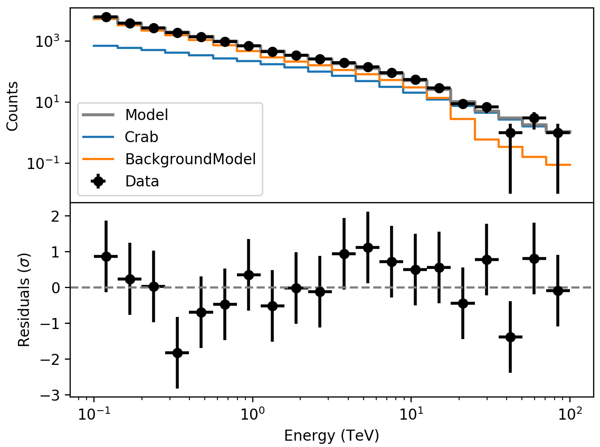

.. _sec_residual_spectrum:

Inspecting the spectral fit residuals
-------------------------------------

  .. admonition:: What you will learn

     You will learn how to use the :ref:`csresspec` script to **inspect the
     spectral fit residuals**.

The spatial fit residuals are only one part of the quality check, and you should
also inspect the spectral fit residuals. You do this using the :ref:`csresspec`
script.

.. code-block:: bash

   $ csresspec components=yes
   Input event list, counts cube, or observation definition XML file [events.fits] cntcube.fits
   Input exposure cube file [NONE] expcube.fits
   Input PSF cube file [NONE] psfcube.fits
   Input background cube file [NONE] bkgcube.fits
   Input model definition XML file [$CTOOLS/share/models/crab.xml] crab_results.xml
   Mask data to calculate residuals in ROI? [no]
   Residuals computation algorithm (SUB|SUBDIV|SUBDIVSQRT|SIGNIFICANCE) [SIGNIFICANCE]
   Output residual spectrum file [resspec.fits]

This produces a FITS file ``resspec.fits`` containing the residual spectrum.
Note the hidden ``components`` parameter that instructs :ref:`csresspec` to
include the individual model components in the results file.
A graphical display of the result file is shown below.

   *Data, model, and residuals from the spectral fit of the Crab nebula*

.. note::
   The figure was created by typing:

   .. code-block:: bash

      $ $CTOOLS/share/examples/python/show_residuals.py resspec.fits

   Use the option ``-h`` to select the table to display if there are
   multiple observations.

