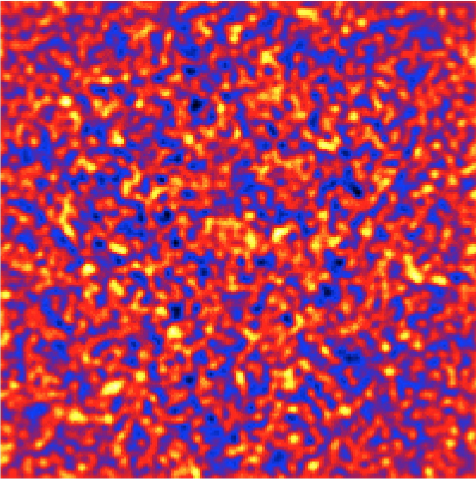

.. _start_residuals:

Inspecting the fit residuals
----------------------------

  .. admonition:: What you will learn

     You will learn how to use the :ref:`csresmap` script to **inspect the
     fit residuals**.

After having done a maximum likelihood fit it is good practice to inspect the
fit residuals. You do this with the :ref:`csresmap` script that creates a
residual sky map of the events from which the fitted model components were
subtracted. You run the :ref:`csresmap` script as follows:

.. code-block:: bash

   $ csresmap
   Input event list, counts cube, or observation definition XML file [events.fits] cntcube.fits
   Input model cube file (generated with ctmodel) [NONE]
   Input exposure cube file [NONE] expcube.fits
   Input PSF cube file [NONE] psfcube.fits
   Input background cube file [NONE] bkgcube.fits
   Input model definition XML file [$CTOOLS/share/models/crab.xml] crab_results.xml
   Residual map computation algorithm (SUB|SUBDIV|SUBDIVSQRT|SIGNIFICANCE) [SIGNIFICANCE]
   Output residual map file [resmap.fits]

.. note::
   :ref:`csresmap` is a Python script while the other tools that you have
   used so far are C++ binary executables. From the User perspective, Python
   scripts and C++ binary executables behave the same way, but to distinguish
   both all Python scripts names start with ``cs`` while all C++ binary
   executables names start with ``ct``.

The :ref:`csresmap` script produces the FITS file ``resmap.fits`` that contains
the residual counts map. The image is displayed below using
`ds9 <http://ds9.si.edu>`_ with a linear color scale and with a small Gaussian
kernel smoothing applied. Obviously, there are no significant residuals, which
indicates that the model fit was satisfactory.

   *Residual sky map of the selected events with all model components subtracted*

.. note::
   :ref:`csresmap` implements different algorithms for the computation of the
   residuals. These are:

   * ``SUB``: :math:`DATA - MODEL`
   * ``SUBDIV``: :math:`(DATA - MODEL) / MODEL`
   * ``SUBDIVSQRT``: :math:`(DATA - MODEL) / \sqrt{MODEL}`
   * ``SIGNIFICANCE``: :math:`{\rm sign}(DATA-MODEL) \times \sqrt{ 2 \times ( DATA \times \ln \left(\frac{DATA}{MODEL} \right) + MODEL - DATA ) }`

   By default the ``SIGNIFICANCE`` algorithm is used.
