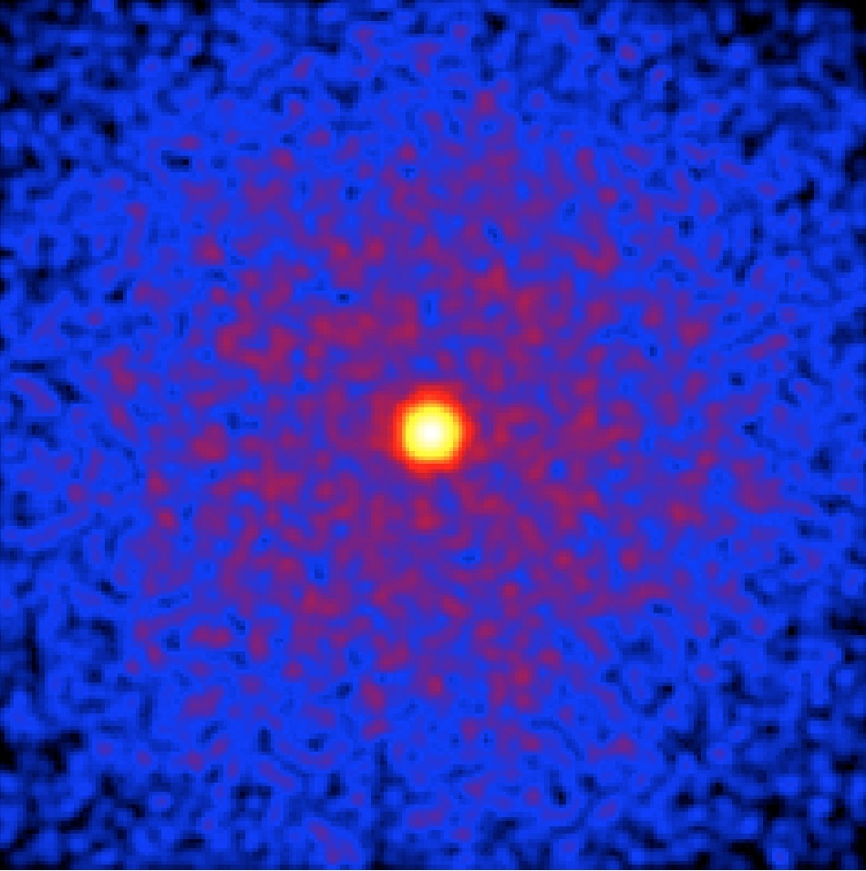
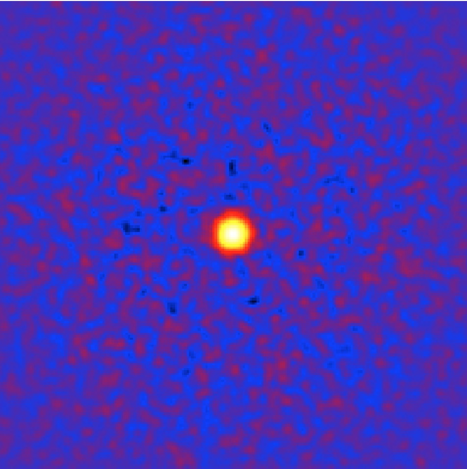

.. _start_skymap:

Generating a sky map
--------------------

  .. admonition:: What you will learn

     You will learn how to use the :ref:`ctskymap` tool to **generate a sky
     map from the selected event data**.

Now let's have a look into the selected data by generating a sky map. You do
this with the :ref:`ctskymap` tool as follows:

.. code-block:: bash

   $ ctskymap
   Input event list or observation definition XML file [events.fits] selected_events.fits
   First coordinate of image center in degrees (RA or galactic l) (0-360) [83.63]
   Second coordinate of image center in degrees (DEC or galactic b) (-90-90) [22.01]
   Projection method (AIT|AZP|CAR|GLS|MER|MOL|SFL|SIN|STG|TAN) [CAR]
   Coordinate system (CEL - celestial, GAL - galactic) (CEL|GAL) [CEL]
   Image scale (in degrees/pixel) [0.02]
   Size of the X axis in pixels [200]
   Size of the Y axis in pixels [200]
   Lower energy limit (TeV) [0.1]
   Upper energy limit (TeV) [100.0]
   Background subtraction method (NONE|IRF) [NONE]
   Output skymap file [skymap.fits]

The tool produces the file ``skymap.fits`` which contains a sky map of the
events in FITS format. The sky map is centred on the location of the Crab
nebula (Right Ascension 83.63 deg, Declination 22.01 deg) and consists of
200 x 200 spatial pixels of 0.02 x 0.02 degrees in size, covering
an area of 4 deg x 4 deg.

Below an image of the sky map, displayed using
`ds9 <http://ds9.si.edu>`_ in logarithmic color scale with a small Gaussian
kernel smoothing applied:

   *Sky map of the selected events*

The sky map shows the Crab nebula on top of a wide-spread distribution of
events that originates from the instrumental background.
The
:ref:`instrument response functions <glossary_irf>`
contain templates that describe the spatial and spectral distribution of
the background, and :ref:`ctskymap` can make use of these templates
to subtract the background contribution from the sky map.
You enable the background subtraction by running the :ref:`ctskymap` tool with
the background subtraction method set to ``IRF``, as shown in the following
example:

.. code-block:: bash

   $ ctskymap
   Input event list or observation definition XML file [events.fits] selected_events.fits
   First coordinate of image center in degrees (RA or galactic l) (0-360) [83.63]
   Second coordinate of image center in degrees (DEC or galactic b) (-90-90) [22.01]
   Projection method (AIT|AZP|CAR|GLS|MER|MOL|SFL|SIN|STG|TAN) [CAR]
   Coordinate system (CEL - celestial, GAL - galactic) (CEL|GAL) [CEL]
   Image scale (in degrees/pixel) [0.02]
   Size of the X axis in pixels [200]
   Size of the Y axis in pixels [200]
   Lower energy limit (TeV) [0.1]
   Upper energy limit (TeV) [100.0]
   Background subtraction method (NONE|IRF) [NONE] IRF
   Calibration database [prod2]
   Instrument response function [South_0.5h] 
   Output skymap file [skymap.fits] skymap_subtracted.fits

The resulting sky map, displayed using
`ds9 <http://ds9.si.edu>`_ in logarithmic color scale with a small Gaussian
kernel smoothing applied is shown below:

   *Background subtracted sky map of the selected events*

