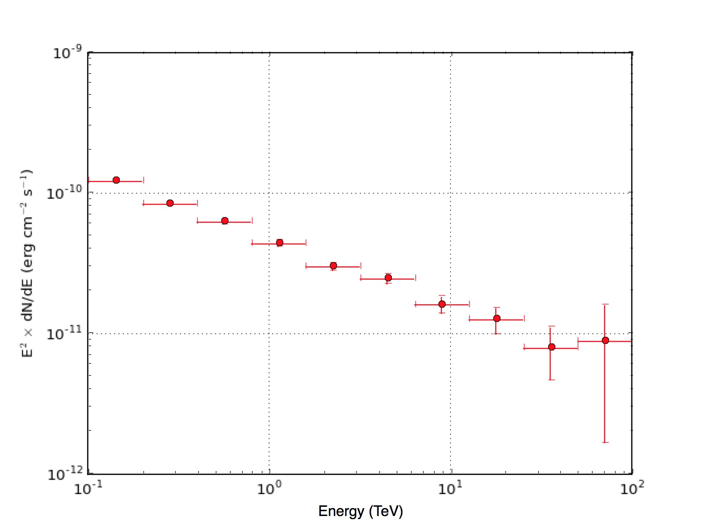

.. _start_spectrum:

Deriving a source spectrum
--------------------------

  .. admonition:: What you will learn

     You will learn how to use the :ref:`csspec` script to **derive the spectral
     energy distribution (SED) of a gamma-ray source**.

You may also be interested in the determination of the spectral energy
distribution (SED) of the Crab nebula that is independent of an assumed
spectral shape. This can be achieved by the :ref:`csspec` script.

The :ref:`csspec` script divides the energy range into a number of indepedent
energy bins and performs in each of the energy bins a maximum likelihood fit
of the source model. Since the spectral shape is generally poorly constrained
within a narrow energy bin, all spectral parameters except of the scaling
factor of the source model will be fixed for the fitting. The fit results will
be converted into a flux value per energy bin. The script also determines
upper flux limits as well as the Test Statistic value of the source in each
of the bins.

Below an example how of you can determine the SED of the Crab for 10 energy
bins between 100 GeV and 100 TeV:

.. code-block:: bash

   $ csspec
   Input event list, counts cube, or observation definition XML file [events.fits] cntcube.fits
   Input exposure cube file [NONE] expcube.fits
   Input PSF cube file [NONE] psfcube.fits
   Input background cube file [NONE] bkgcube.fits
   Input model definition XML file [$CTOOLS/share/models/crab.xml] crab_results.xml
   Source name [Crab]
   Spectrum generation method (SLICE|NODES|AUTO) [AUTO]
   Binning algorithm (LIN|LOG|FILE) [LOG]
   Lower energy limit (TeV) [0.1]
   Upper energy limit (TeV) [100.0]
   Number of energy bins [20] 10
   Output spectrum file [spectrum.fits]

There are different methods to create a binned spectrum:

- SLICE splits the dataset in independent energy slices, and performs
  an independent fit in each of them
- NODES performs an overall fit where the source of interest is
  modeled spectrally using a node function, whit a free parameter for
  the flux in each energy bin
- AUTO is SLICE for CTA and NODES for other instruments.

The :ref:`csspec` script creates the FITS file ``spectrum.fits`` that contains
the results of the SED fitting. A graphical display of the fit results is
shown below.

   *Spectral energy distribution of the Crab nebula*

.. note::
   The figure was created by typing:

   .. code-block:: bash

       $ $CTOOLS/share/examples/python/show_spectrum.py spectrum.fits
