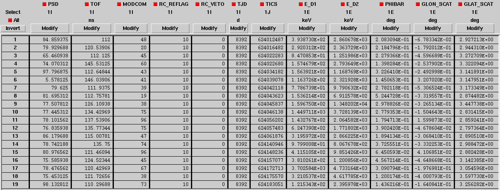

.. _um_comptel_data:

COMPTEL data
------------

For COMPTEL data ctools operates also on event lists. An event list is a table
where each row corresponds to a registered event and each column corresponds to a
property of the event. Relevant properties are the event time, the Compton scatter
direction and scatter angle, the Earth horizon angle, the energy deposits in the
two detector layers, the x and y interaction locations in the second detector
layer, the PSD and ToF channel values, the module combination and the rejection
an veto flags. Event lists are provided as FITS binary tables. An example for a
COMPTEL event list is shown below.

Metadata, such as the telescope pointing direction or any other information that
may be relevant for data processing, is stored in the FITS header of the event
list binary table. An example for the metadata that is included in the header of
the COMPTEL event lists is shown below.

In addition, so called Orbit Aspect Data are needed for COMPTEL data analysis, which
are presented in form a FITS table where each row corresponds to a so-called
superpacket (a time slice of 16.384 s) and each column corresponds to orbital information
for the given time slice. An example for a COMPTEL Orbit Aspect Data table is shown
below.

Furthermore :ref:`Good Time Intervals (GTIs) <glossary_gti>` need to be specified, which
for COMPTEL are given as so-called ``TIM`` files. Each row in a ``TIM`` file corresponds
to a time interval of continuous data taking, and the ``USAGE`` column specifies whether
the time interval should be used for science analysis. An example for a COMPTEL ``TIM``
file is shown below.

