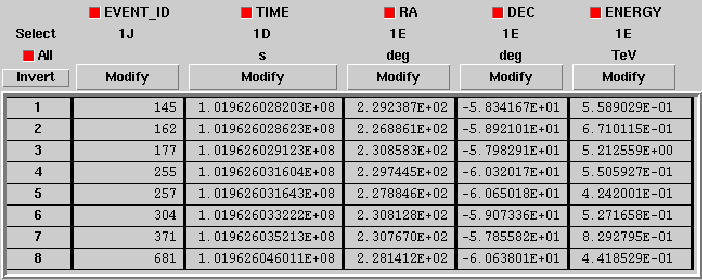
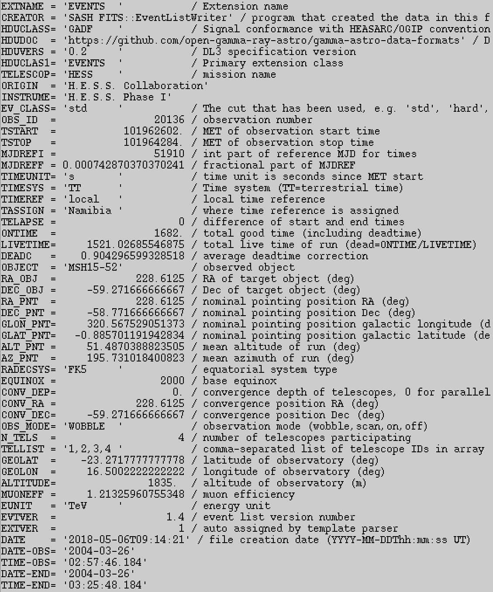
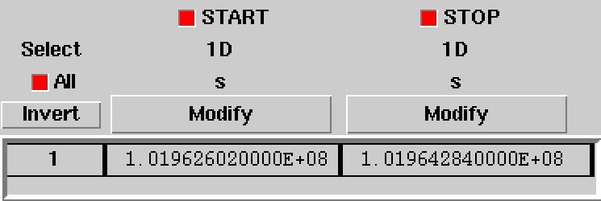

.. _um_data:

The data
--------

ctools operates on event lists. An event list is a table where each row
corresponds to a registered event and each column corresponds to a property
of the event. Required properties are the event identifier, the reconstructed
event direction, the reconstructed event energy and the trigger time. Event
lists are provided as FITS binary tables. An example for a minimal event list
is shown below.

Metadata, such as the telescope pointing direction, the live time, or any other
information that may be relevant for data processing, is stored in the FITS
header of the event list binary table. An exemple for the metadata that is
included in the header of the H.E.S.S. Collaboration event lists is shown
below.

Every event list needs to be accompanied by a table with so-called Good Time
Intervals (GTIs) where each row corresponds to a time interval of continuous
data taking, and the two columns correspond to the start and stop times of these
time intervals. An exemple for the GTIs of the H.E.S.S. event lists comprising
a single GTI is shown below.

Note that times are given in so-called Mission-Elapsed Time (MET) in seconds,
and that the zero-point of the MET is specified by the ``MJDREFI`` and
``MJDREFF`` keywords as the integer and fraction part of a Modified Julian Date
(MJD) in the header of the GTI. The same holds also for the trigger times in
the event list.
