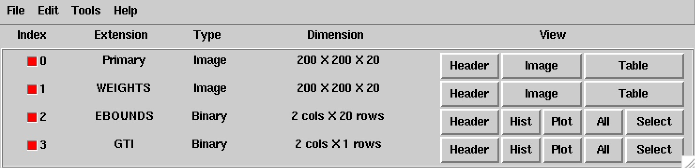

.. _sec_binning_cta:

Binning CTA data
~~~~~~~~~~~~~~~~

As next analysis step you will bin the data into a counts cube using
:ref:`ctbin`.
A counts cube is a 3-dimensional data cube, spanned by
Right Ascension (or Galactic longitude), Declination (or Galactic latitude),
and energy (by default logarithmically spaced, but this is under your control).

:ref:`ctbin` is executed by typing:

.. code-block:: bash

  $ ctbin
  Input event list or observation definition XML file [events.fits] 
  First coordinate of image center in degrees (RA or galactic l) (0-360) [83.63] 
  Second coordinate of image center in degrees (DEC or galactic b) (-90-90) [22.01] 
  Projection method (AIT|AZP|CAR|MER|MOL|STG|TAN) [CAR] 
  Coordinate system (CEL - celestial, GAL - galactic) (CEL|GAL) [CEL] 
  Image scale (in degrees/pixel) [0.02] 
  Size of the X axis in pixels [200] 
  Size of the Y axis in pixels [200] 
  Algorithm for defining energy bins (FILE|LIN|LOG) [LOG] 
  Start value for first energy bin in TeV [0.1] 
  Stop value for last energy bin in TeV [100.0] 
  Number of energy bins [20] 
  Output counts cube file [cntcube.fits] 

In this example the events from file ``events.fits`` will be binned into
a counts cube stored into the file ``cntcube.fits``. The counts cube
is centred on the location of the Crab nebula (Right Ascension 83.63°,
Declination 22.01°). A cartesian projection aligned in celestial
coordinates is used and the counts cube has
200 x 200 spatial pixels of 0.02 x 0.02 degrees in size, covering
an area of 4° x 4°, and 20 logarithmically spaced energy bins, covering
an energy range from 0.1 TeV to 100 TeV.

The ``cntcube.fits`` file produced by :ref:`ctbin` contains four extensions:

* A primary 3-dimensional image extension providing the number of events
  per counts cube bin,
* a 3-dimensional image extension ``WEIGHT`` where each bin gives the
  fractional overlap between a counts cube bin and the Region of Interest
  covered by the event list,
* a table extension ``EBOUNDS`` that defines the energy boundaries of the
  counts cube, and
* a table extension ``GTI`` that defines the Good Time Intervals of the counts
  cube.

The following image shows the ``cntcube.fits`` file produced in the example
above. The ``EBOUNDS`` table has 20 rows, one for each energy bin, while the
``GTI`` table has just a single row, indicating the start and stop time of the
simulated data.

   *Extensions of a counts cube FITS file*

An image of the first bin, covering the energy range 100 - 141 GeV, is 
shown below:

.. figure:: cntmap-map.jpg
   :height: 400px
   :align: center

   *Image of first energy bin of a counts cube*

For illustration, the last few lines of the log file ``ctbin.log`` are 
reproduced below:

.. code-block:: none

  2016-06-29T10:33:23: +=================+
  2016-06-29T10:33:23: | Bin observation |
  2016-06-29T10:33:23: +=================+
  2016-06-29T10:33:23: === CTA observation ===
  2016-06-29T10:33:23:  Events in list ............: 23099
  2016-06-29T10:33:23:  Events in cube ............: 18532
  2016-06-29T10:33:23:  Event bins outside RoI ....: 0
  2016-06-29T10:33:23:  Events outside cube area ..: 4567
  2016-06-29T10:33:23:  Events outside energy bins : 0

From the 23099 events that have been simulated and stored in the
``events.fits`` file, 18532 lie within the cube boundaries and are thus put
into the resulting counts cube.
