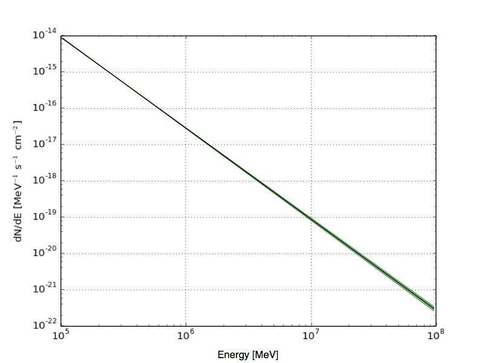

.. _sec_butterfly_cta:

Calculating and visualising a butterfly diagram
~~~~~~~~~~~~~~~~~~~~~~~~~~~~~~~~~~~~~~~~~~~~~~~

To visualise the analysis results you can compute a butterfly diagram 
which shows the confidence band of the spectral fit using the
:ref:`ctbutterfly` tool.
The butterfly diagram is the envelope of all power law models
that are within a given confidence limit compatible with the data.
By default a confidence level of 68% is used, but the level can be adjusted
using the hidden ``confidence`` parameter.
:ref:`ctbutterfly` computes this envelope by evaluating for each energy the
minimum and maximum intensity of all power law models that fall within the
error ellipse of the prefactor and index parameters.
The error ellipse is derived from the covariance matrix of a maximum
likelihood fit.

The following example illustrates how you can use the :ref:`ctbutterfly`
tool:

.. code-block:: bash

  $ ctbutterfly
  Input event list, counts cube or observation definition XML file [events.fits] 
  Calibration database [prod2] 
  Instrument response function [South_0.5h] 
  Input model XML file [$CTOOLS/share/models/crab.xml] crab_results.xml
  Source of interest [Crab] 
  Start value for first energy bin in TeV [0.1] 
  Stop value for last energy bin in TeV [100.0] 
  Output ASCII file [butterfly.txt] 

Now that you have computed the confidence band of the spectral fit and 
that you will have an ASCII file named ``butterfly.txt`` on disk you can
visualise the butterfly using the script ``show_butterfly.py`` that is 
in the ctools ``example`` folder. You will need matplotlib on your system
to make this work. To launch the script, type:

.. code-block:: bash

  $CTOOLS/share/examples/python/show_butterfly.py butterfly.txt
	
This will result in a canvas which should look like the following:

   *Confidence band of the power law fit*
 