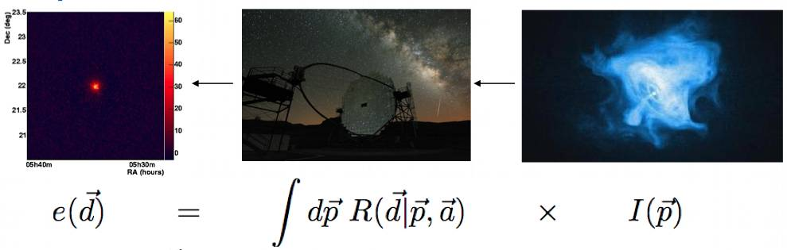

.. _response:

CTA Instrument Response Functions
---------------------------------

What are instrument response functions?
~~~~~~~~~~~~~~~~~~~~~~~~~~~~~~~~~~~~~~~

The instrument response functions provide a mathematical description that
links the measured quantities :math:`\vec{d}` of an event to the physical
quantities :math:`\vec{p}` of the incident photon. The following figure 
illustrates this relationship:

:math:`I(\vec{p})` is the gamma-ray intensity arriving at Earth as a
function of photon properties :math:`\vec{p}` 
(which usually are true photon energy, true photon incident direction, 
and true photon arrival time),
while :math:`e(\vec{d})` is the expected event rate as function of event 
properties :math:`\vec{d}` (which usually are the measured photon energy,
measured or reconstructued photon incident direction, and measured photon 
arrival time). The expected event rate is obtained by integrating the
product of 
the instrumental response function :math:`R(\vec{d}|\vec{p},\vec{a}`)
and the emitted intensity :math:`I(\vec{p})` over the photon properties
:math:`\vec{p}`.
The argument :math:`\vec{a}` in the response function comprises any 
auxiliary parameter on which the response function may depend on (e.g. 
pointing direction, triggered telescopes, optical efficiencies, 
atmospheric conditions, etc.). All these quantities and hence the 
instrument response function may depend on time.

CTA response functions
~~~~~~~~~~~~~~~~~~~~~~

The instrument response functions for CTA are factorised into 
the effective area :math:`A_{\rm eff}(p, E, t)` (units :math:`cm^2`),
the point spread function :math:`PSF(p' | p, E, t)`,
and the energy dispersion :math:`E_{\rm disp}(E' | p, E, t)`
following:

.. math::
    R(p', E', t' | p, E, t) =
    A_{\rm eff}(p, E, t) \times
    PSF(p' | p, E, t) \times
    E_{\rm disp}(E' | p, E, t)

ctools are shipped with response functions for the northern and southern
arrays, and variants are available that have been optimised for exposure
times of 0.5 hours, 5 hours and 50 hours.
In total, the following six instrument response functions are available:
``North_0.5h``, ``North_5h``, ``North_50h``, ``South_0.5h``,
``South_5h``, and ``South_50h``.

Each response is stored in a single FITS file, and each component of
the response factorisation is stored in a binary table of that FITS
file.
In addition, the response files contain an additional table that
describes the background rate as function of energy and position in
the field of view.
An example of a CTA response file is shown below:

.. figure:: irf-file.png
   :width: 100%

Each table in the response file is in a standardised format that is
the one that is also used for the Fermi/LAT telescope.
As an example, the effective area component of the response file
is shown below.
Response information is stored in a n-dimensional cube, and each axis
of this cube is described by the lower and upper edges of the axis bins.
In this example the effective area is stored as a 2D matrix with the
first axis being energy and the second axis being offaxis angle.
Effective area information is stored for true (``EFFAREA``) and
reconstructed (``EFFAREA_RECO``) energy.
Vector columns are used to store all information.

.. figure:: irf-aeff.png
   :width: 100%

Specifying CTA response functions
~~~~~~~~~~~~~~~~~~~~~~~~~~~~~~~~~

The specification of the CTA Instrument Response Functions depends on the 
way how ctools are used. Common to all methods is that the IRFs are 
defined by a response name and a calibration database name.
ctools makes use of HEASARC's CALDB format to index and store
IRFs, and specification of the database and response names is
sufficient to access the response.

Specifying the response function as input parameters
^^^^^^^^^^^^^^^^^^^^^^^^^^^^^^^^^^^^^^^^^^^^^^^^^^^^

ctools that require instrument response functions have two parameters
to specify the calibration database name and the response function name.
The following example shows a ``ctobssim`` run using the ``prod2``
calibration database and the ``South_0.5h`` response function:

.. code-block:: bash

  $ ctobssim
  RA of pointing (degrees) (0-360) [83.63] 
  Dec of pointing (degrees) (-90-90) [22.51] 
  Radius of FOV (degrees) (0-180) [5.0] 
  Start time (MET in s) [0.0] 
  End time (MET in s) [1800.0] 
  Lower energy limit (TeV) [0.1] 
  Upper energy limit (TeV) [100.0] 
  Calibration database [prod2] 
  Instrument response function [South_0.5h] 
  Input model XML file [$CTOOLS/share/models/crab.xml] 
  Output event data file or observation definition XML file [events.fits]

Running the other tools is equivalent.

Specifying the response function in an observation definition file
^^^^^^^^^^^^^^^^^^^^^^^^^^^^^^^^^^^^^^^^^^^^^^^^^^^^^^^^^^^^^^^^^^

In the above example, only a single global response function can be
used for all CTA observations. If you need to specify response functions
per observation you can add the information directly in the XML observation 
definition file:

.. code-block:: xml

  <observation_list title="observation library">
    <observation name="Crab" id="00001" instrument="CTA">
      <parameter name="EventList"   file="events.fits"/>
      <parameter name="Calibration" database="prod2" response="South_0.5h"/>
    </observation>
  </observation_list>

The ``Calibration`` parameter specifies the calibration database and
response name. You can then pass this file directly to, e.g., ``ctlike``:

.. code-block:: bash

  $ ctlike
  Input event list, counts cube or observation definition XML file [events.fits] obs_irf.xml
  Input model XML file [$CTOOLS/share/models/crab.xml] 
  Output model XML file [crab_results.xml] 

Note that ``ctlike`` does not ask for the calibration database and
response name as it found the relevant information in the XML file.

.. _sec_cta_rsp_abspath:

Specifying individual instrument response files
^^^^^^^^^^^^^^^^^^^^^^^^^^^^^^^^^^^^^^^^^^^^^^^

If you need even more control over individual response files, you can
specify them individually in the XML observation file as follows:

.. code-block:: xml

  <observation_list title="observation library">
    <observation name="Crab" id="00001" instrument="CTA">
      <parameter name="EventList"           file="events.fits"/>
      <parameter name="EffectiveArea"       file="$CALDB/data/cta/prod2/bcf/North_0.5h/irf_file.fits.gz"/>
      <parameter name="PointSpreadFunction" file="$CALDB/data/cta/prod2/bcf/North_0.5h/irf_file.fits.gz"/>
      <parameter name="EnergyDispersion"    file="$CALDB/data/cta/prod2/bcf/North_0.5h/irf_file.fits.gz"/>
      <parameter name="Background"          file="$CALDB/data/cta/prod2/bcf/North_0.5h/irf_file.fits.gz"/>
    </observation>
  </observation_list>

From within a Python script
^^^^^^^^^^^^^^^^^^^^^^^^^^^

The following example illustrates how to set the calibration database
and response name from within Python:

.. code-block:: python

  import gammalib
  obs   = gammalib.GCTAObservation()
  caldb = gammalib.GCaldb("cta", "prod2")
  irf   = "South_0.5h"
  obs.response(irf, caldb)

The calibration database is set by creating a ``GCaldb`` object. The
constructor takes as argument the mission (always ``cta``) and the 
database name, in our case ``prod2``. The response function is then set
by passing the response name (here ``South_0.5h``) and the calibration
database object to the ``response`` method.
