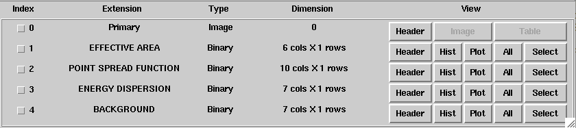

.. _um_irf_cta:

CTA response functions
----------------------

Formulation
~~~~~~~~~~~

The :ref:`instrument response functions <glossary_irf>` for CTA (as well as the
other IACTs such as H.E.S.S., VERITAS and MAGIC) are factorised into
the effective area :math:`A_{\rm eff}(p,E,t)` (units :math:`cm^2`),
the point spread function :math:`PSF(p'|p,E,t)`,
and the energy dispersion :math:`E_{\rm disp}(E'|p,E,t)`
following

.. math::
    R(p',E',t'|p,E,t) = A_{\rm eff}(p,E,t) \times PSF(p'|p,E,t) \times
                        E_{\rm disp}(E'|p,E,t)

where

.. math::
   \int PSF(p'|p,E,t) \, dp' = 1

and

.. math::
   \int E_{\rm disp}(E'|p,E,t) \, dE' = 1

For the point spread function, two variants exist that both depend on energy
and off-axis angle, but differ in the functional form that is used to describe
the PSF. The first variant implements a superposition of three 2D Gaussian
functions that are each characterised by a width and a relative amplitude.
Alternatively, a King profile defined by

.. math::
   \mathrm{\it PSF}(p'|p,E,t) = \frac{1}{2 \pi \sigma^2}
   \left( 1 - \frac{1}{\gamma} \right)
   \left( 1 + \frac{1}{2 \gamma} \frac{\delta^2}{\sigma^2} \right)^{-\gamma}

can be used, where :math:`\delta` is the angular separation between the true
and measured photon directions :math:`p` and :math:`p'`, respectively,
:math:`\sigma` describes the width and :math:`\gamma` the tail of the
distribution.

Format
~~~~~~

Each response is stored in a single FITS file, and each component of the
response factorisation is stored in a binary table of that FITS file.
In addition, the response files contain an additional table that describes the
background rate as function of energy and position in the field of view.
An example of a CTA response file is shown below:

Each table in the response file is in a standardised format that is the one
that is also used for the Fermi/LAT telescope. As an example, the effective
area component of the response file is shown below. Response information is
stored in a n-dimensional cube, and each axis of this cube is described by the
lower and upper edges of the axis bins. In this example the effective area is
stored as a 2D matrix with the first axis being energy and the second axis
being offaxis angle. Effective area information is stored for true
(``EFFAREA``) and reconstructed (``EFFAREA_RECO``) energy. Vector columns are
used to store all information.

.. figure:: irf_cta_aeff.png
   :width: 100%

Getting CTA IRFs
~~~~~~~~~~~~~~~~

ctools are shipped with the CTA ``prod2`` response functions for the northern
and southern arrays, and variants are available that have been optimised for
exposure times of 0.5 hours, 5 hours and 50 hours.
In total, the following six instrument response functions are available:
``North_0.5h``, ``North_5h``, ``North_50h``, ``South_0.5h``,
``South_5h``, and ``South_50h``.

The latest CTA reponse functions (``prod5-v0.1``) can be downloaded from
`this link <https://zenodo.org/record/5499840#.YVV1di0itZo>`_.

Addition of CTA response functions to the calibration database can be done
using the script :download:`csadd2caldb.py <csadd2caldb.py>` that is available
for download.

To download and install the ``prod5-v0.1`` response functions you should execute
the following commands in a terminal:

.. code-block:: bash

   $ mkdir temp
   $ cd temp
   $ wget https://zenodo.org/record/5499840/files/cta-prod5-zenodo-fitsonly-v0.1.zip
   $ unzip cta-prod5-zenodo-fitsonly-v0.1.zip
   $ ./csadd2caldb.py
   Parfile csadd2caldb.par not found. Create default parfile.
   Input IRF folder [fits]
   Output caldb folder [$CALDB]

This will download the file ``cta-prod5-zenodo-fitsonly-v0.1.zip`` in a
temporary working directory, unzip the file to get, among others, the folder ``fits``
with the CTA response in FITS format, and install the response in your calibration
database.

Use ``sudo`` to run ``csadd2caldb.py`` if the installation of the IRFs requires
root privileges.

To use the ``prod5-v0.1`` response functions, specify ``prod5-v0.1`` if a ctool
or cscript queries for the calibration database.

If you want to install the older ``prod3b-v2`` response functions you should use
the following procedure:

.. code-block:: bash

   $ mkdir temp
   $ cd temp
   $ wget https://zenodo.org/record/5163273/files/CTA-Performance-IRFs-prod3b-v2-v1.0.0.zip
   $ unzip CTA-Performance-IRFs-prod3b-v2-v1.0.0.zip
   $ tar xvfz CTA-Prod3-Zenodo-main/fits/CTA-Performance-prod3b-v2-FITS.tar.gz -C $CTOOLS/share

To use the ``prod3b-v2`` response functions, specify ``prod3b-v2`` if a ctool
or cscript queries for the calibration database.

.. note::
   If you use the CTA instrument response functions for a research project
   and specifically for a presentation or publication, we ask to add the
   following acknowledgement to the presentation or publication:

   *This research has made use of the CTA instrument response functions
   provided by the CTA Consortium and Observatory.*

Specifying CTA response functions
~~~~~~~~~~~~~~~~~~~~~~~~~~~~~~~~~

The specification of the CTA :ref:`Instrument Response Functions <glossary_irf>`
depends on the way how ctools are used. Common to all methods is that the IRFs
are defined by a response name and a calibration database name.
ctools makes use of HEASARC's CALDB format to index and store
IRFs, and specification of the database and response names is
sufficient to access the response.

Specifying the response function as input parameters
^^^^^^^^^^^^^^^^^^^^^^^^^^^^^^^^^^^^^^^^^^^^^^^^^^^^

ctools that require :ref:`instrument response functions <glossary_irf>` have
two parameters to specify the calibration database name and the response
function name.
The following example shows a ``ctobssim`` run using the ``prod2``
calibration database and the ``South_0.5h`` response function:

.. code-block:: bash

   $ ctobssim
   RA of pointing (degrees) (0-360) [83.63]
   Dec of pointing (degrees) (-90-90) [22.51]
   Radius of FOV (degrees) (0-180) [5.0]
   Start time (UTC string, JD, MJD or MET in seconds) [2020-01-01T00:00:00]
   Stop time (UTC string, JD, MJD or MET in seconds) [2020-01-01T00:30:00]
   Lower energy limit (TeV) [0.1]
   Upper energy limit (TeV) [100.0]
   Calibration database [prod2]
   Instrument response function [South_0.5h]
   Input model XML file [$CTOOLS/share/models/crab.xml]
   Output event data file or observation definition XML file [events.fits]

Running the other tools is equivalent.

Specifying the response function in an observation definition file
^^^^^^^^^^^^^^^^^^^^^^^^^^^^^^^^^^^^^^^^^^^^^^^^^^^^^^^^^^^^^^^^^^

In the above example, only a single global response function can be used for all
CTA observations. If you need to specify response functions per observation you
can add the information directly in the
:ref:`observation definition XML file <glossary_obsdef>`. You will learn more
about :ref:`observation definition XML files <glossary_obsdef>` in the
section :ref:`um_observations`. Here an example of specifying the response
information in the :ref:`observation definition XML file <glossary_obsdef>`:

.. code-block:: xml

  <observation_list title="observation library">
    <observation name="Crab" id="00001" instrument="CTA">
      <parameter name="EventList"   file="events.fits"/>
      <parameter name="Calibration" database="prod2" response="South_0.5h"/>
    </observation>
  </observation_list>

The ``Calibration`` parameter specifies the calibration database and
response name. You can then pass this file directly to, e.g., ``ctlike``:

.. code-block:: bash

  $ ctlike
  Input event list, counts cube or observation definition XML file [events.fits] obs_irf.xml
  Input model XML file [$CTOOLS/share/models/crab.xml] 
  Output model XML file [crab_results.xml] 

Note that ``ctlike`` does not ask for the calibration database and
response name as it found the relevant information in the XML file.

.. _sec_cta_rsp_abspath:

Specifying individual instrument response files
^^^^^^^^^^^^^^^^^^^^^^^^^^^^^^^^^^^^^^^^^^^^^^^

If you need even more control over individual response files, you can
specify them individually in the
:ref:`observation definition XML file <glossary_obsdef>` as follows:

.. code-block:: xml

  <observation_list title="observation library">
    <observation name="Crab" id="00001" instrument="CTA">
      <parameter name="EventList"           file="events.fits"/>
      <parameter name="EffectiveArea"       file="$CALDB/data/cta/prod2/bcf/North_0.5h/irf_file.fits.gz"/>
      <parameter name="PointSpreadFunction" file="$CALDB/data/cta/prod2/bcf/North_0.5h/irf_file.fits.gz"/>
      <parameter name="EnergyDispersion"    file="$CALDB/data/cta/prod2/bcf/North_0.5h/irf_file.fits.gz"/>
      <parameter name="Background"          file="$CALDB/data/cta/prod2/bcf/North_0.5h/irf_file.fits.gz"/>
    </observation>
  </observation_list>

From within a Python script
^^^^^^^^^^^^^^^^^^^^^^^^^^^

The following example illustrates how to set the calibration database
and response name from within Python:

.. code-block:: python

   >>> import gammalib
   >>> obs   = gammalib.GCTAObservation()
   >>> caldb = gammalib.GCaldb("cta", "prod2")
   >>> irf   = "South_0.5h"
   >>> obs.response(irf, caldb)

The calibration database is set by creating a ``GCaldb`` object. The
constructor takes as argument the mission (always ``cta``) and the 
database name, in our case ``prod2``. The response function is then set
by passing the response name (here ``South_0.5h``) and the calibration
database object to the ``response`` method.
