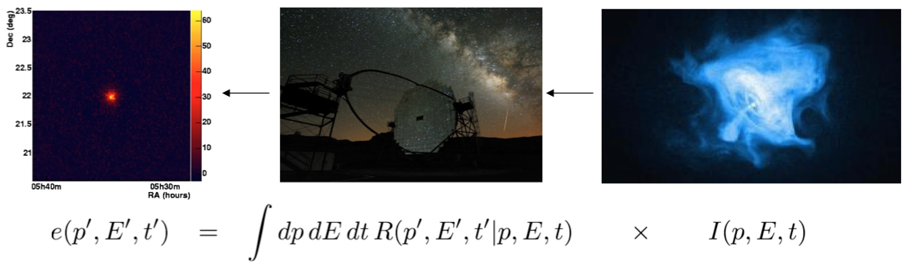

.. _um_irf_intro:

What are instrument response functions?
---------------------------------------

The :ref:`instrument response functions <glossary_irf>` provide a mathematical
description that links the reconstructed photon arrival direction :math:`p'`,
energy :math:`E'` and trigger time :math:`t'` of an event to the true incident
direction :math:`p`, energy :math:`E` and time :math:`t` of a photon. The
following figure illustrates this relationship:

:math:`I(p,E,t)` is the gamma-ray intensity arriving at Earth as a function of
direction :math:`p`, energy :math:`E` and time :math:`t`. :math:`e(p',E',t')`
is the expected event rate as function of the reconstructed direction
:math:`p'`, energy :math:`E'` and trigger time :math:`t'`. The expected event
rate is obtained by integrating the product of the instrumental response
function :math:`R(p',E',t'|p,E,t)` and the emitted intensity :math:`I(p,E,t)`
over the direction, energy and time.
