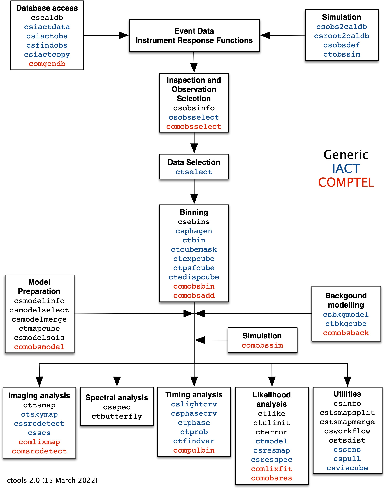

.. _um_overview:

Overview
--------

A summary of the tools and scripts available in ctools is presented in the
figure below. The tools are grouped according to functionality, and arranged
according to the typical usage in a workflow. According to our naming
convention, tools starting with the letters ``ct`` are implemented as C++
executables, and tools starting with the letters ``cs`` are implemented as
Python scripts.

The scripts :ref:`csiactdata`, :ref:`csiactobs`, :ref:`csfindobs` and
:ref:`csiactcopy` support access to IACT data, and in particular the H.E.S.S.
data in FITS format, provided that the user has the appropriate access rights.
:ref:`cscaldb` inspects the calibration database that is installed on the
user's computer and informs about the available
:ref:`instrument response functions <glossary_irf>`.

The scripts :ref:`csobs2caldb` and :ref:`csroot2caldb` generate
response databases from existing observations or ROOT files. :ref:`csobsdef`
generates :ref:`observation definition files <glossary_obsdef>` from information
provided in an ASCII file in csv format, and :ref:`ctobssim` simulates events
for one or several observations based on an input model that describes the
gamma-ray sources and the irreducable particle background.

:ref:`csobsinfo` inspects an :ref:`observation definition file <glossary_obsdef>`
and :ref:`csobsselect` allows the selection of a subset of observations based on
pointing direction and observing dates.

:ref:`ctselect` selects events from one or several observations based on
reconstructed event direction, energy and trigger time.

The tools :ref:`ctbin`, :ref:`ctexpcube`, :ref:`ctpsfcube`, :ref:`ctedispcube`
and :ref:`ctbkgcube` perform the binning of the event data and the computation
of the response cubes that are needed for a stacked binned analysis.
:ref:`ctcubemask` enables the masking of individual bins from a binned analysis.
:ref:`csphagen` prepares the ``PHA``, ``ARF`` and ``RMF`` files for an On/Off
analysis, and :ref:`csebins` generates custom energy binnings for all binning
tools.

:ref:`csbkgmodel` prepares a standard background model for the analysis of
IACT data that was validated on H.E.S.S. data. :ref:`csmodelinfo`
inspects any given :ref:`model definition file <glossary_moddef>`,
:ref:`csmodelmerge` merges several :ref:`model definition files <glossary_moddef>`
into a single one, and :ref:`csmodelsois` extracts sources of interest from a
:ref:`model definition file <glossary_moddef>` and replaces the remaining sources
by a diffuse map cube.

:ref:`ctskymap` generates sky maps from the data and :ref:`cssrcdetect`
detects sources in the sky map and writes them into a
:ref:`model definition file <glossary_moddef>`.

:ref:`csspec` generates a spectrum and :ref:`ctbutterfly` computes a butterfly
diagram for a given gamma-ray source.

:ref:`cslightcrv` generate a light curve and :ref:`csphasecrv` a phase curve
for a source. :ref:`ctphase` computes for each event the phase for a periodic
source, based on a simple phase model. :ref:`ctprob` computes for each event
the probability that it arises from a specific model component. :ref:`ctfindvar`
searches for time variable sources using an On/Off method in the time domain.

:ref:`ctlike` is the workhorse of ctools and performs a maximum likelihood
estimation of model parameters. In case that a source is not significantly
detected, :ref:`ctulimit` will allow to assess its upper flux limit.
:ref:`cterror` computes parameter errors from the likelihood profile, coping
also with asymmetric uncertainites. :ref:`cttsmap` generates a test statistic
map, and :ref:`ctmodel` computes the expected model cube for a given
:ref:`model definition file <glossary_moddef>`. :ref:`csresmap` generates
a residual map and :ref:`csresspec` a residual spectrum to allow assessing
of the model fit quality.

Finally a number of utilities exist. ``csinfo`` checks whether the software
is properly installed, :ref:`cstsmapsplit` splits the test statistic
computation in multiple jobs and :ref:`cstsmapmerge` merges the resulting
maps into a single test statistic map, ``csworkflow`` implements a
workflow manager for analysis pipelines, :ref:`cstsdist` generates a test
statistic distribution and :ref:`cspull` computes the pull distribution of
model parameters for a given source based on simulations, :ref:`cssens`
computes the array sensitivity, :ref:`ctmapcube` transforms any source model
into a map cube, and :ref:`csviscube` computes a visibility map of the sky from
a given array site.

