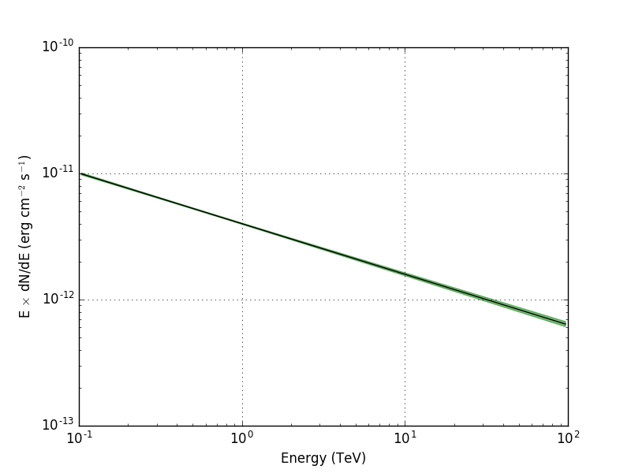
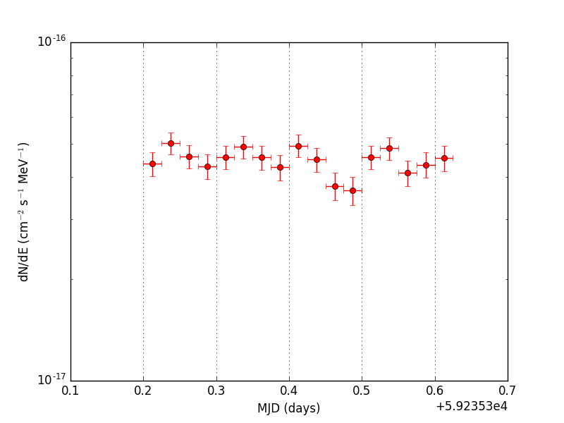
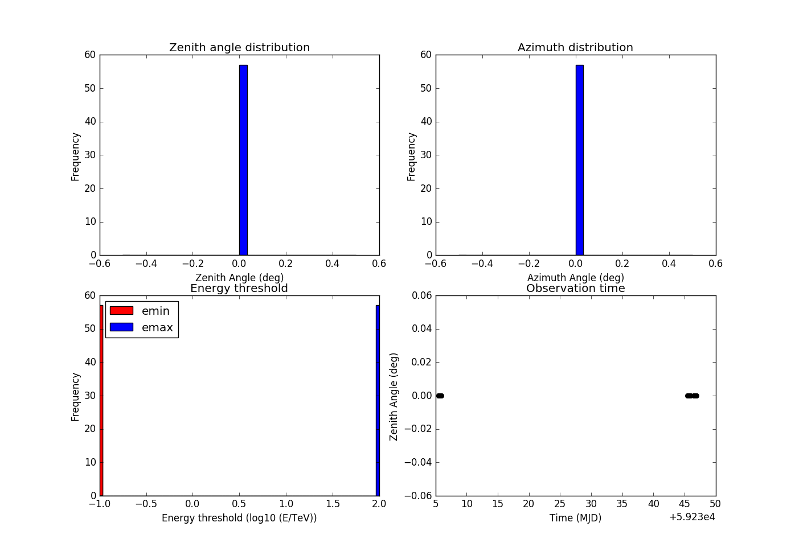
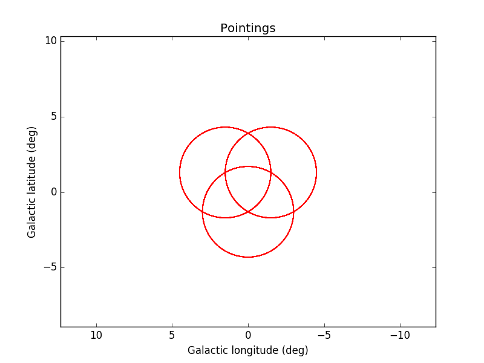
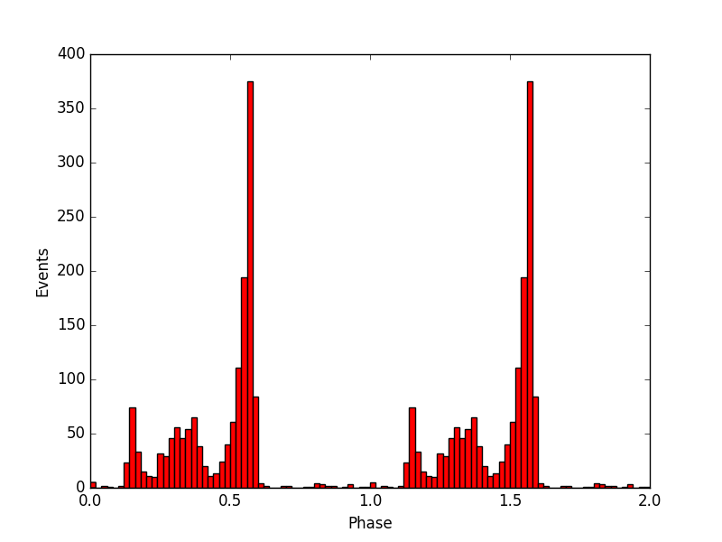
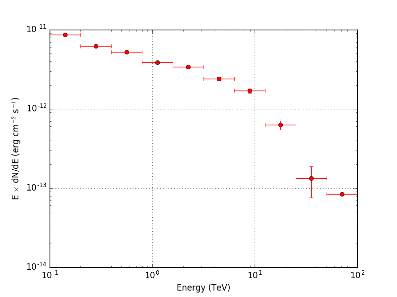

Plotting
========

ctools and GammaLib do not include classes and scripts to make plots.

This is intentional because creating and maintaining plotting tools that work
on all platforms and cover all needs is a big project in itself, and deciding
to support a plotting package that is popular now as part of the CTA science
tools could become very problematic in the future.

But we realise that most ctools users need to create plots for their high-level
science results, so on this page we provide a few pointers to external packages
and tools.

Nevertheless, for your convenience several scripts for graphical display are
included in the ctools package that rely on the
`matplotlib <http://matplotlib.org>`_
Python module. You can find these scripts in the
``$CTOOLS/share/examples/python`` folder. The following scripts are available:

  +------------------------+-----------------------------+
  | Script                 | Usage                       |
  +========================+=============================+
  | ``show_butterfly.py``  | Display a butterfly diagram |
  +------------------------+-----------------------------+
  | ``show_lightcurve.py`` | Display a light curve       |
  +------------------------+-----------------------------+
  | ``show_obs.py``        | Display observation summary |
  +------------------------+-----------------------------+
  | ``show_pointings.py``  | Display pointing directions |
  +------------------------+-----------------------------+
  | ``show_phases.py``     | Display event phases        |
  +------------------------+-----------------------------+
  | ``show_spectrum.py``   | Display a spectrum          |
  +------------------------+-----------------------------+

Below some usage examples and the expected output.

show_butterfly.py
^^^^^^^^^^^^^^^^^

.. code-block:: bash

   $ $CTOOLS/share/examples/python/show_butterfly.py butterfly_src001.txt

   *Butterfly diagram displayed with show_butterfly.py*

show_lightcurve.py
^^^^^^^^^^^^^^^^^^

.. code-block:: bash

   $ $CTOOLS/share/examples/python/show_lightcurve.py lightcurve.fits

   *Light curve displayed with show_lightcurve.py*

show_obs.py
^^^^^^^^^^^

.. code-block:: bash

   $ $CTOOLS/share/examples/python/show_obs.py obs_selected.xml

   *Observation summary displayed with show_obs.py*

show_pointings.py
^^^^^^^^^^^^^^^^^

.. code-block:: bash

   $ $CTOOLS/share/examples/python/show_pointings.py obs_selected.xml

   *Observation summary displayed with show_pointings.py (zoomed in)*

show_phases.py
^^^^^^^^^^^^^^

.. code-block:: bash

   $ $CTOOLS/share/examples/python/show_phases.py -n 50 events_phased.fits

   *Event phases displayed with show_phases.py*

show_spectrum.py
^^^^^^^^^^^^^^^^

.. code-block:: bash

   $ $CTOOLS/share/examples/python/show_spectrum.py spectrum_src001.fits

   *Observation summary displayed with show_spectrum.py*
